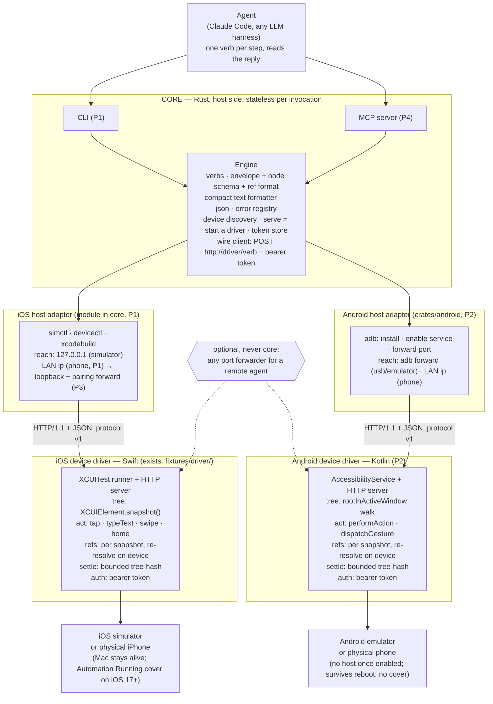

# agent-mobile — Product Requirements Document

Status: draft v0.2, 2026-09-20. Owner: Lahfir. Language: Rust (host), Swift (iOS driver), Kotlin (Android driver).
Evidence base: `docs/research/` (13 tracks), `docs/experiments/RESULTS.md` (Experiments 1–8, verbatim).

## 0. Summary

agent-mobile is a CLI that lets an AI agent drive iOS and Android apps the way agent-browser drives
the web: take a snapshot of the accessibility tree, act on an element by reference, take the next
snapshot. The driver runs on the device or simulator and speaks plain HTTP on a local port; the Rust
CLI is a stateless client. The loop is already proven end to end on the iOS 26 simulator and on a
physical iPhone 14 Pro over Wi-Fi (Experiments 5–8). This document turns that probe into a product
in four phases and names the one gate that decides whether the product should exist at all: a
measured reliability win over Maestro MCP and mobile-mcp on identical tasks.

## 1. Problem

Agents can already drive a phone. Maestro ships an MCP server, mobile-mcp exists, and Appium has
MCP wrappers. What none of them ships is a contract an agent can rely on: element references that
fail loudly when stale instead of tapping the wrong thing, a bounded settle check instead of an
unbounded "wait for idle", and one action that returns the next tree instead of a find-then-act
round trip. The research track on prior art lists settle detection and reference stability as
unsolved industry-wide, and every published reliability number in the space is an unaudited
self-report (docs/research/09 §8, docs/research/11). Physical iOS is the weakest link everywhere:
Maestro states it is not supported; mobile-mcp needs a USB-trusted device (docs/research/09). We did
the full loop over Wi-Fi with one script (Experiments 7 and 8).

## 2. Users

1. An AI coding agent (Claude Code, Codex, Cursor, any harness) driving a mobile app step by step.
   It reads one compact snapshot per step and issues one verb. The only user in P1–P3.
2. A developer running that agent against their own app on a simulator, an emulator, or their own
   phone. They install the CLI, start one driver, and hand the agent the tool.

## 3. Goals and non-goals

Goals
- One contract across iOS and Android: one envelope, one node schema, and `@<snapshot_id>:eN` refs.
- Fail-loud references: every action re-resolves on the device; a stale or ambiguous target is an
  error, never a guess.
- Bounded waits: every action settles with a finite cap and reports what it saw.
- Zero setup: one binary, one driver per platform, no Appium server, no capabilities file, no
  WebDriverAgent build.
- Local by default: the driver listens on a local port; nothing leaves the machine unless the
  developer forwards the port themselves.
- Simulator and physical device for both platforms, on the same network.
- Measured reliability, published with seed variance.
- No hidden retry and no fuzzy match, anywhere.

Non-goals
- Replacing Appium or Maestro for scripted regression suites. Breadth is theirs.
- Cloud device farms, WebView/CDP bridging, games and canvas UIs (vision-only territory).
- Tunnels, relays, and QR pairing as product code. A tunnel is a documented adapter script.
- Self-healing locators. No production framework ships them and none publishes accuracy (docs/research/11).
- A daemon or hub in the core. The driver is the long-lived process; the CLI is stateless.
- Play Store or App Store distribution of the agent pieces (docs/research/10).

## 4. Architecture



Component rules
- The driver owns the tree, the refs, the settle, and the auth, because the live tree is there.
  The core owns the contract, the formatting, process control, and the wire client.
- The core never parses a tree beyond formatting it. Ref resolution runs on the device.
- One driver process per device, one port each. The CLI maps device to port through a small state
  file under `~/.agent-mobile/`.
- Today's iOS driver (`fixtures/driver/ToDoUITests/AgentMobileServer.swift`, 267 lines) is the P1
  driver as is, plus a Home press at start on the simulator. The host app in that project is a
  scaffold the UI-test target needs; the driver never touches it.
- Physical iOS needs a host process (the Mac) alive for the session (docs/research/02). The agent
  never needs the phone screen; the tree and the screenshot endpoint carry the state.

## 5. Contract

### 5.1 Wire protocol

Every call is an HTTP/1.1 `POST /<verb>` request with a JSON body, `Authorization: Bearer <token>`, and `Connection: close`. The CLI sends its protocol version as `X-Agent-Mobile-Version`; a mismatched driver refuses with `BAD_REQUEST`, the nearest fit; today's driver checks none.

Verbs, read from the driver's `handle(_:_:)` switch; "settled snapshot" below means `data: {app, snapshot_id, ref_count, complete, settled, reads, text, tree}`:

| Verb | Body params | Returns | Notes |
|---|---|---|---|
| `status` | none | `app, snapshot_id, device, os` | No tree, no settle step. |
| `launch` | `bundle_id` | settled snapshot | Cold-launches the app; it becomes the active bundle. |
| `activate` | `bundle_id` | settled snapshot | Foregrounds an already-running app; not in the P1 CLI. |
| `terminate` | none | `terminated: bundle` | Only verb whose reply is not a settled snapshot. |
| `snapshot` | `app?` | settled snapshot | Switches the active bundle first if `app` is given. |
| `tap` | `ref`, or `x` and `y` | settled snapshot | `x,y` are points from the app frame's top-left corner, not a 0-1 fraction. |
| `type` | `text`, `ref?` | settled snapshot | Taps `ref` first if given, else types into current focus. |
| `swipe` | `direction`, `ref?` | settled snapshot | `direction` is one of up/down/left/right, else `BAD_REQUEST`; swipes `ref` if given, else the whole app. |
| `home` | none | settled snapshot | Presses the hardware Home button; resets the active bundle to `com.apple.springboard`. |
| `screenshot` | none | `png_base64` | No settle step; not a tree snapshot. |

**Envelope.** Success returns `{version, ok, command, elapsed_ms, data}`; failure returns the same shape with `ok:false` and `error:{code, message}` in place of `data`; a 401 for a bad token omits `command` and `elapsed_ms`, returned before the command dispatches. `version` is the protocol version, fixed at `1` for P1, bumped only on a breaking change; today's probe driver reports `0.1-probe`. The error object carries `code` and `message` only. Error codes: `STALE_REF, AMBIGUOUS_TARGET, BAD_REQUEST, UNKNOWN_COMMAND, UNAUTHORIZED, DRIVER_ERROR`; status and agent behavior per code are in §5.3.

**Node.** Every node carries a `ref_id`, because mobile trees have tappable unnamed containers; the text listing prints only named or interactive nodes, so token cost is unchanged. Every node carries `bounds` as `{x, y, width, height}`; P1 renames the driver's keys to those. `native_id.kind` is `ax_identifier` in P1 and gains `resource_id`, `test_tag`, and `test_id` with Android.

**Text listing.** The driver's `Accept: text/plain` path returns a header line plus one line per named or interactive node, useful directly against the driver (`am.sh`, curl). The core owns the text formatter: the CLI always requests JSON and renders the same line format itself, including for `status`, `terminate`, and `screenshot`. From a live run against Calendar:

```
app=com.apple.mobilecal snapshot=@upii2see refs=127 settled=true reads=2 elapsed_ms=5101
@upii2see:e1 application "Calendar" at=0,0 size=440x956
```

**Settle.** After every action or snapshot, the driver re-reads the tree every 150 ms, hashing each node's type, integer frame, label, identifier, and value, until two consecutive reads match or 3 s pass. `settled` reports which happened; `reads` reports how many tries; a `settled: false` reply still returns the last, usable, read.

**Refs.** Refs are minted per snapshot as `@<snapshot_id>:e<N>`. Each settled snapshot discards every prior ref before minting new ones, so a ref resolves only against the snapshot that produced it. An action re-resolves its ref against the live tree by element type, accessibility identifier, label, and frame, allowing at most 1 pt of difference in x, y, width, and height. A snapshot-id mismatch or zero live matches returns `STALE_REF`; more than one live match returns `AMBIGUOUS_TARGET`; the driver never guesses. Example: a ref taken on the empty Title field dies once text goes in, because the label changes from the placeholder to the identifier and the width shrinks (Experiment 8). That is the contract at work: re-snapshot after any action that changes the target.

### 5.2 CLI surface

The CLI is stateless per call against the long-lived driver. Eight of eleven P1 commands map to a same-named driver verb; `devices` and `serve` have none, and `stop` sends `terminate`.

| Command | Args | Wire call | Notes |
|---|---|---|---|
| `devices` | none | none | Lists reachable simulators and devices; CLI-side only. |
| `serve` | `<device-udid>` | starts driver | Runs in the foreground; prints the token and URL for `AGENT_MOBILE_URL`/`AGENT_MOBILE_TOKEN`. `--app` pre-launches a bundle. |
| `status` | none | `status` | |
| `snapshot` | none | `snapshot` | `--app` sets `app`; the driver honors no `max_depth` today: `build()` has no depth cutoff and `complete` is hardcoded `true`. |
| `tap` | `<ref>`, or `<x> <y>` | `tap` | One argument is read as `ref`; two are read as `x y`. |
| `type` | `[ref] <text>` | `type` | A leading argument shaped like `@<id>:eN` is consumed as `ref`; remaining arguments join into `text`. |
| `swipe` | `<direction> [ref]` | `swipe` | `direction`: up, down, left, or right. |
| `home` | none | `home` | |
| `launch` | `<bundle_id>` | `launch` | |
| `screenshot` | `[output-path]` | `screenshot` | Decodes `png_base64`; writes to `output-path`, or stdout if omitted. |
| `stop` | none | `terminate` | |

Wire calls are read from the driver. `devices`, `serve`, and the argument shapes are new CLI specification.

**Flags and environment.** `--app` sets the target bundle: `app` on `snapshot`, `bundle_id` on the `launch` that `serve --app` triggers. `--max-depth` applies to every settled-snapshot verb and lives in the core: the driver returns the full tree, the core drops nodes below the depth and sets `complete: false`. `AGENT_MOBILE_URL` and `AGENT_MOBILE_TOKEN` set the driver's address and token for every other command.

**Exit codes.** `0` ok, `1` error envelope (including a `DRIVER_ERROR` the CLI synthesizes for a transport failure with no envelope at all), `2` usage error.

### 5.3 Error registry

HTTP status per code is read from the driver's response builder.

| Code | HTTP status | Meaning | What the agent should do |
|---|---|---|---|
| `STALE_REF` | 409 | The ref's snapshot id does not match the current snapshot, or no live element matches it. | Re-snapshot, then retry the action with a fresh ref. |
| `AMBIGUOUS_TARGET` | 409 | More than one live element matches the ref's identity evidence. | Re-snapshot with a narrower root, or use a ref with a firmer `native_id`, then retry. |
| `BAD_REQUEST` | 409 | A required body field is missing, or a value like `direction` is invalid. | Fix the request; do not retry unchanged. |
| `UNKNOWN_COMMAND` | 409 | The path does not match a known verb. | Fix the client; do not retry. |
| `UNAUTHORIZED` | 401 | The bearer token is missing or wrong. | Fix `AGENT_MOBILE_TOKEN`; do not retry unchanged. |
| `DRIVER_ERROR` | 500 | An error the driver did not anticipate. | Retry once; escalate if it recurs. |

## 6. Phases

### 6.0 Done (P0) — what is proven

- Research: 13 tracks, synthesized in `docs/research/README.md`.
- Experiment 5, simulator: an agent created a Calendar event by ref with no scripted steps; a stale ref was rejected in 4 ms.
- Experiment 6, tunnel: the same driver through a public URL; settled snapshot in 393 ms; 401 without the token.
- Experiments 7 and 8, physical iPhone 14 Pro over Wi-Fi: the full Calendar loop in four calls of 1.8 to 2.3 s each; status in 0.076 s on the LAN; one STALE_REF in Experiment 7 with an unknown trigger, none in Experiment 8.

### 6.1 P1 — Rust CLI and core, iOS only

**Scope**
- P1 wraps the existing, already-proven Swift driver (§6.0) in a Rust CLI plus core.
- It runs on the simulator and an iPhone on the same network.
- Verb set: devices, serve, status, snapshot, tap, type, swipe, home, launch, screenshot, stop.
- Text output by default; `--json` gives JSON.
- Each session's token is stored under `~/.agent-mobile`.
- Driver cleanups: envelope version `1`, `X-Agent-Mobile-Version` check, `bounds` keys renamed to `{x,y,width,height}`, Home press at start on the simulator, no default token in any script.
- `serve` recognizes the "certificate is not trusted" launch failure and prints the re-trust steps (Experiment 8).
- Developer experience, the P1 acceptance bar: `npm i -g agent-mobile` then `agent-mobile snapshot` is the whole start. The first verb starts the driver if none runs (lazy start), boots the default simulator, saves the session under `~/.agent-mobile/`, and then runs the verb. `serve` stays as the explicit form.
- The npm package ships a prebuilt simulator runner, so the simulator path builds nothing on the user's Mac (Maestro's pattern, docs/research/09 §5). A physical iPhone builds and signs once with the Xcode account on that Mac; `--device <name>` is remembered.
- Every error names the next action: a stale ref says re-snapshot, a missing Xcode says the install step, a missing simulator says the create command, a trust refusal says the three Settings steps.
- `agent-mobile skills` prints the one-page agent guide.

**Out of scope**
- Android, the in-app SDK, the benchmark, and the MCP wrapper wait for later phases.

**Exit criterion** — Experiment 9: the CLI creates a Calendar event on the simulator and the phone, verbatim; the driver presses Home first on the simulator so no runner screen shows. The simulator run starts from a clean machine state with only `npm i -g agent-mobile` and no `serve` call.

### 6.2 P2 — Android device driver

**Scope**
- Android gets a device driver: a Kotlin app with an `AccessibilityService`, using the same HTTP protocol as iOS.
- A host adapter drives it over `adb`: install, enable the service, forward the port.
- It runs on the emulator and a physical phone.
- The contract types gain `native_id` kinds `resource_id`, `test_tag`, and `test_id`.

**Out of scope**
- Compose `testTag` support and instrumentation/Shizuku wait for Later; Play listing is permanently out (§6.5).

**Exit criterion** — Experiment 10: an alarm created in the Clock app through the CLI, verbatim.

### 6.3 P3 — Reliability gate

**Scope**
- The §9 benchmark runs agent-mobile against Maestro MCP and mobile-mcp.
- A third read or a minimum settle window fixes the early-settle case in §8.
- A springboard/system-alert surface handles permission dialogs; `scroll_until_visible` ships.
- Physical-iOS hardening moves the bind to loopback plus a pairing-channel port forward.

**Out of scope**
- Everything in §6.5's Later and Never lists.

**Exit criterion** — Experiment 11: the benchmark completes across all tasks and seeds against both competitors, and §9's kill criterion applies to the pooled result.

### 6.4 P4 — MCP server and release

**Scope**
- An MCP server wraps the same verbs over the same core; nothing new.
- The skills doc ships bundled.

**Out of scope**
- Any verb the CLI does not already expose.

**Exit criterion** — Experiment 12: after publishing to npm and cargo, a stock MCP client repeats Experiment 9's Calendar event through the MCP server.

### 6.5 Later / Never

**Later**
- The iOS in-app SDK, a zero-host rail for a developer's own app.
- Compose `testTag` read via `refreshWithExtraData` in the Android service.
- List dedup in the text snapshot.
- Instrumentation/Shizuku for permission grants and rotation.

**Never**
- Self-healing locators.
- A hub or daemon in the core.
- A QR pairing flow on the XCUITest rail.
- Tunnel logic in the code; tunnels stay a documented adapter script.
- A Play Store listing of the Android agent.

## 7. Engineering practices

### 7.1 Workspace and layout

`docs/research/`, `docs/experiments/`, and `fixtures/driver/` exist. The Rust workspace is new.

```
agent-mobile/
├── Cargo.toml
├── crates/core/      # host logic; the iOS adapter is a module inside it
├── src/              # CLI binary, one command per file
├── scripts/          # source-rule check, used by CI and the pre-commit hook
├── fixtures/driver/  # existing Swift XCUITest driver
└── docs/             # research tracks, experiments, this PRD
```

`crates/android` arrives with the Android driver. There is never a `crates/ios`. The contract types
live in `crates/core`.

Toolchain: Rust 1.89.0, pinned in `rust-toolchain.toml`, with clippy and rustfmt. License: Apache-2.0.

Dependencies stay small: `clap`, `serde`, `serde_json`, and blocking HTTP through `ureq` or a
`std::net::TcpStream` with `Connection: close`. No async runtime.

### 7.2 Rust source rules

There is no Rust port of the JavaScript "anti-slop" oxlint ruleset. This list is its equivalent for
this repo.

- clippy runs the pedantic group at warn, plus a small deny list. CI runs `cargo clippy --all-targets -- -D warnings`.
- `cognitive_complexity` is enabled, with `cognitive-complexity-threshold = 12` in `clippy.toml`.
- `too_many_lines` is enabled, with `too-many-lines-threshold = 100`.
- Hard limit: 400 lines per `.rs` file. clippy has no file-length lint, so a script enforces it in CI and in the pre-commit hook.
- No inline `//` or `/* */` comments. Only `///` and `//!` doc comments. The same script enforces this.
- A doc comment is at most 15 lines per item. The same script enforces this.
- CI runs `cargo fmt --check` and `cargo deny check`.

### 7.3 Testing

Core testing has exactly three kinds.

| Kind | Proves | Needs a simulator |
|---|---|---|
| Unit tests | the text formatter and ref parsing | no |
| Golden fixture tests (in-crate) | the core parses real driver JSON correctly | no |
| Integration test (one) | the CLI boots a simulator, starts the driver, and reads one real snapshot | yes |

Fixtures are recorded from the driver JSON in Experiments 5 through 7, never hand-written, so the
core stays testable with no simulator. The one integration test lives at
`tests/integration_snapshot.rs` and doubles as driver smoke.

### 7.4 CI

Day one has two CI jobs. An Android emulator job joins once its driver exists. Physical devices are
never in CI.

| Job | Runner | Steps | Gate |
|---|---|---|---|
| `lint-and-test` | `ubuntu-latest` | `cargo fmt --check`; `cargo clippy --all-targets -- -D warnings`; the source-rule script; `cargo test --lib --locked`; `cargo deny check` | any step failing blocks merge |
| `simulator-integration` | `macos-latest` | `cargo test --test integration_snapshot --locked` (the test boots the simulator and starts the driver itself) | the snapshot assertion must pass |
| `android-emulator` (later) | `ubuntu-latest` | boot emulator; run the Android integration equivalent | added when `crates/android` exists |

Workflow hygiene: `permissions: {}` at the top, per-job `contents: read`, SHA-pinned actions, a
`timeout-minutes` per job, and `--locked` on every cargo command.

### 7.5 Release and versioning

Releases run through release-please. Conventional Commit titles drive the version bump and the
changelog. The binary crate publishes to crates.io and npm wraps the prebuilt binary; `crates/core`
stays `publish = false`. The npm package points `bin` at a JS shim, runs a `postinstall` script,
and sets `engines.node >=18`.

The protocol version stays independent of the crate version. A breaking protocol change needs a
`feat!:` title or a `BREAKING CHANGE:` footer, bumps the envelope version string, and ships the
driver and CLI together in one release.

### 7.6 Security policy

- A token is required on every route. The driver is LAN-only by default. No tunnel logic in the code (§3 non-goals).
- A token generates fresh per `serve` call, stored under `~/.agent-mobile/` at mode `0600`; no script carries a default.
- Logs may keep the command name, `elapsed_ms`, and the ok/error outcome, never the token.
- `SECURITY.md` states the scope: the CLI, the core, and the drivers.
- P1 cleanup: `fixtures/driver/am.sh` defaults to a committed token today, and `fixtures/driver/start-device.sh` writes its token to `/tmp/agent-mobile-device-token` with no `chmod` call.

### 7.7 Definition of done for any phase

1. The `lint-and-test` and `simulator-integration` CI gates (§7.4) pass.
2. An Experiment entry in `docs/experiments/RESULTS.md` records verbatim output.
3. No token or secret appears in logs, diffs, or committed scripts.
4. `README.md` and the relevant `docs/` file reflect any command or protocol change.

## 8. Risks

| Risk (evidence) | Mitigation | Phase |
|---|---|---|
| Settle check fires early on a device; two matching reads 150 ms apart while a layout pass was pending (Exp 7, not reproduced in Exp 8, trigger unknown) | Third read or a minimum settle window | P3 |
| "Automation Running" cover on physical iOS 17+ for the whole session (Exp 7) | Inherent to the XCUITest rail; only the in-app SDK rail avoids it | Later |
| A host must stay alive for physical iOS: pairing, DDI mount, launch handshake, keep-alive (docs/research/02) | The Mac runs xcodebuild for the whole session | P1 |
| Plain HTTP on the LAN hop and a 0.0.0.0 bind on the phone (README) | Loopback bind plus a pairing-channel port forward | P3 |
| Compose `testTag` is invisible unless the service calls `refreshWithExtraData` (docs/research/08) | P2 ships without it; the service adds the call later | Later |
| Play policy bans autonomous use of the accessibility API since November 2025 (docs/research/05, 10) | Sideload, GitHub release, or enterprise channel; never Play | P2 |
| One `UiAutomation` owner per device if instrumentation is added (docs/research/06, 09) | Instrumentation and Shizuku stay an optional add-on, never the base rail | Later |
| Developer certificate trust lapsed after about an hour; runner refused to launch until re-trusted (Exp 8, n=2) | `serve` prints the re-trust steps; a paid profile removes the gate | P1 |
| Field reliability numbers are unaudited; one paper measured 26 to 33 percent seed swings (docs/research/09 §8) | Report the benchmark's seed variance with the mean | P3 |

## 9. Success metrics

The P3 benchmark is the reliability gate: ship or stop turns on its result.

| Parameter | Value |
|---|---|
| Platform | Simulator and emulator only. Maestro's own README states plainly that physical iOS devices are not yet supported, including through its MCP server. A shared task set needs every tool able to attempt every task, so physical iOS is out of the comparison even though agent-mobile itself can run it (§6.0). |
| Tasks | 10, identical across all three tools |
| Seeds | at least 5 per task per tool |
| Model | one fixed model, held constant across agent-mobile, Maestro MCP, and mobile-mcp |
| Tools compared | agent-mobile vs. Maestro MCP vs. mobile-mcp |
| Metrics | task success rate, steps per task, STALE_REF count, wall time |

Report each metric as a mean and spread across seeds, per task and pooled.

Kill criterion, verbatim: "if agent-mobile is not measurably more reliable than both competitors on the same tasks, stop the product and contribute the ref and settle contract upstream."

## 10. Known limitations

- Physical iOS needs a Mac with Xcode alive for the whole session, a paired device, Developer Mode,
  and a trusted developer certificate. No cable after pairing. No zero-host mode on this rail.
- Physical iOS shows the system "Automation Running" cover for the whole session. Not removable.
- The Developer certificate trust on the phone lapsed after about an hour in Experiment 8. Expect a manual re-trust step until a paid profile is used.
- The two-read settle check can declare "settled" while a late layout pass is still pending on a
  device (Experiment 7). The fail-loud ref check catches it; P3 tightens it.
- The phone driver binds all interfaces on the LAN in P1. The token is the only gate on that hop.
  P3 replaces it with a loopback bind and a pairing-channel forward.
- Canvas, games, and opaque WebViews expose no tree. Vision is out of scope.
- Android: the agent app is sideload only. Play policy bans this use of the accessibility API.

## 11. Open question

License: Apache-2.0 is assumed. Owner's call.

## Appendix A. Evidence index

| Claim | Where |
|---|---|
| macOS AX cannot see inside the simulator | `docs/experiments/RESULTS.md` Exp 1 |
| XCUITest reads a 179-element tree, 1.10 s cold / 0.66 s warm | Exp 3 |
| Agent-driven drive loop on the simulator, Calendar event created | Exp 5 |
| Driver through a cloudflared tunnel, 0.45 s status, 0.51 s snapshot | Exp 6 |
| Physical iPhone 14 Pro over Wi-Fi and public URL; STALE_REF fired and held | Exp 7 |
| Full loop on the phone over the LAN, event created, no STALE_REF; trust lapse observed | Exp 8 |
| Physical iOS cannot be zero-host | `docs/research/02-ios-connectivity.md` §7 |
| Settle and ref stability unsolved industry-wide | `docs/research/09` §8, `docs/research/11` |
| Android rail: AccessibilityService companion, survives reboot | `docs/research/05`, `docs/research/09` |
| Policy: sideload only, no store listing | `docs/research/05`, `docs/research/10` |
