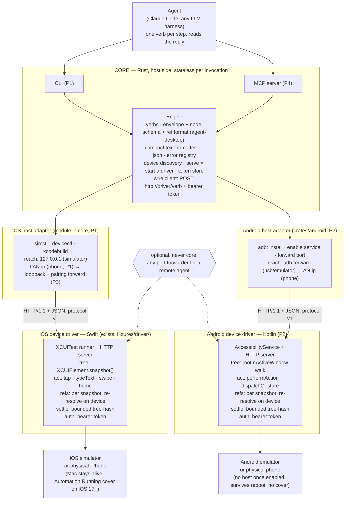

# agent-mobile — Product Requirements Document

Status: draft v0.1, 2026-09-19. Owner: Lahfir. Language: Rust (host), Swift (iOS driver), Kotlin (Android driver).
Evidence base: `docs/` (13 research tracks), `docs/experiments/RESULTS.md` (Experiments 1–8, verbatim).

## 0. Summary

agent-mobile is a CLI that lets an AI agent drive iOS and Android apps the way agent-browser drives
the web and agent-desktop drives the desktop: take a snapshot of the accessibility tree, act on an
element by reference, take the next snapshot. The driver runs on the device or simulator and speaks
plain HTTP on a local port; the Rust CLI is a stateless client with the same contract as its two
siblings. The loop is already proven end to end on the iOS 26 simulator and on a physical iPhone 14
Pro over Wi-Fi (Experiments 5–8). This document turns that probe into a product in four phases and
names the one gate that decides whether the product should exist at all: a measured reliability win
over Maestro MCP and mobile-mcp on identical tasks.

## 1. Problem

Agents can already drive a phone. Maestro ships an MCP server, mobile-mcp exists, and Appium has
MCP wrappers. What none of them ships is a contract an agent can rely on: element references that
fail loudly when stale instead of tapping the wrong thing, a bounded settle check instead of an
unbounded "wait for idle", and one action that returns the next tree instead of a find-then-act
round trip. The research track on prior art lists settle detection and reference stability as
unsolved industry-wide, and every published reliability number in the space is an unaudited
self-report (docs/research/09 §8, docs/11). Physical iOS is the weakest link everywhere: Maestro states it is
not supported; mobile-mcp needs a USB-trusted device (docs/research/09). We did the full loop over Wi-Fi with one script
(Experiments 7 and 8).

## 2. Users and jobs

1. An AI coding agent (Claude Code, Codex, Cursor, any harness) that must test or operate a mobile
   app step by step. It reads one compact snapshot per step and issues one verb. This is the only
   user in P1–P3.
2. A developer who runs that agent against their own app on a simulator, an emulator, or their own
   phone on the same network. They install the CLI, start one driver, and hand the agent the tool.

## 3. Goals and non-goals

Goals
- One contract across web, desktop, and mobile: agent-desktop's envelope, node schema, and
  `@<snapshot_id>:eN` refs, unchanged where a field exists (docs/research/00-agent-desktop-contract.md).
- Fail-loud references: every action re-resolves on the device; a stale or ambiguous target is an
  error, never a guess.
- Bounded waits: every action settles with a finite cap and reports what it saw.
- Zero setup: one binary, one driver per platform, no Appium server, no capabilities file, no
  WebDriverAgent build.
- Local by default: the driver listens on a local port; nothing leaves the machine unless the
  developer forwards the port themselves.
- Simulator and physical device for both platforms, on the same network.
- Measured reliability, published with seed variance.

Non-goals
- Replacing Appium or Maestro for scripted regression suites. Breadth is theirs.
- Cloud device farms, WebView/CDP bridging, games and canvas UIs (vision-only territory).
- Tunnels, relays, and QR pairing as product code. A tunnel is a documented adapter script.
- Self-healing locators. No production framework ships them and none publishes accuracy (docs/research/11).
- A daemon or hub in the core. The driver is the long-lived process; the CLI is stateless.
- Play Store or App Store distribution of the agent pieces (docs/research/10).

## 4. Product principles

The goals in §3 are the principles. Two rules of thumb for contributors: use agent-desktop's name
where one exists, and never add a hidden retry or a fuzzy match. The device driver owns the tree,
the refs, the settle, and the auth, because the live tree is there; the host core owns the
contract, the formatting, process control, and the wire client.

## 5. Architecture



Component rules
- The core never parses a tree beyond formatting it. Ref resolution runs where the live tree is.
- One driver process per device, one port each. The CLI maps a device to a port through a small
  state file under `~/.agent-mobile/`.
- The iOS driver that exists today (`fixtures/driver/ToDoUITests/AgentMobileServer.swift`, 267 lines) is the
  P1 driver as is, plus a Home press at start on the simulator. The host app in that project is a
  scaffold the UI-test target needs; the driver never touches it.
- Physical iOS keeps the constraint the research proved: a host process (the Mac) stays alive for
  the session (docs/research/02). The agent does not need the phone screen; the tree and the screenshot
  endpoint carry the state.

## 6. Contract

### 6.1 Wire protocol

Every call is an HTTP/1.1 `POST /<verb>` request with a JSON body, `Authorization: Bearer <token>`, and `Connection: close`. The CLI sends its protocol version as `X-Agent-Mobile-Version`; a mismatched driver refuses with `BAD_REQUEST`, the nearest fit; today's driver checks none.

Verbs, read from the driver's `handle(_:_:)` switch; "settled snapshot" below means `data: {app, snapshot_id, ref_count, complete, settled, reads, text, tree}`:

| Verb | Body params | Returns | Notes |
|---|---|---|---|
| `status` | none | `app, snapshot_id, device, os` | No tree, no settle step. |
| `launch` | `bundle_id` | settled snapshot | Cold-launches the app; it becomes the active bundle. |
| `activate` | `bundle_id` | settled snapshot | Foregrounds an already-running app; not in the P1 CLI. |
| `terminate` | none | `terminated: bundle` | Only verb whose reply is not a settled snapshot. |
| `snapshot` | `app?` | settled snapshot | Switches the active bundle first if `app` is given. |
| `tap` | `ref`, or `x` and `y` | settled snapshot | `x,y` are points from the app frame's top-left corner, not a 0-1 fraction. |
| `type` | `text`, `ref?` | settled snapshot | Taps `ref` first if given, else types into current focus. |
| `swipe` | `direction`, `ref?` | settled snapshot | `direction` is one of up/down/left/right, else `BAD_REQUEST`; swipes `ref` if given, else the whole app. |
| `home` | none | settled snapshot | Presses the hardware Home button; resets the active bundle to `com.apple.springboard`. |
| `screenshot` | none | `png_base64` | No settle step; not a tree snapshot. |

**Envelope.** Success returns `{version, ok, command, elapsed_ms, data}`; failure returns the same shape with `ok:false` and `error:{code, message}` in place of `data`; a 401 for a bad token omits `command` and `elapsed_ms`, returned before the command dispatches. agent-desktop's `version` is a release constant, `ENVELOPE_VERSION = "2.4"`; agent-mobile's is a protocol version, fixed at `1` for P1, bumped only on a breaking change; today's probe driver reports `0.1-probe`. Error codes: `STALE_REF, AMBIGUOUS_TARGET, BAD_REQUEST, UNKNOWN_COMMAND, UNAUTHORIZED, DRIVER_ERROR`; status and agent behavior per code are in 6.4.

**Text listing.** The driver's own `Accept: text/plain` path returns a header line plus one line per named or interactive node, useful directly against the driver (`am.sh`, curl). Per the locked design the core owns the text formatter: the CLI always requests JSON and renders this same line format itself, including for `status`, `terminate`, and `screenshot`.

Captured from a live run against Calendar:

```
app=com.apple.mobilecal snapshot=@upii2see refs=127 settled=true reads=2 elapsed_ms=5101
@upii2see:e1 application "Calendar" at=0,0 size=440x956
```

**Settle.** After every action or snapshot, the driver re-reads the tree every 150 ms, hashing each node's type, integer frame, label, identifier, and value, until two consecutive reads match or 3 s pass. `settled` reports which happened; `reads` reports how many tries; a `settled: false` reply still returns the last, usable, read.

**Refs.** Refs are minted per snapshot as `@<snapshot_id>:e<N>`, the format agent-desktop assembles in `qualify_ref_id`. Each settled snapshot discards every prior ref before minting new ones, so a ref resolves only against the snapshot that produced it. An action re-resolves its ref against the live tree by element type, accessibility identifier, label, and frame, allowing at most 1 pt of difference in x, y, width, and height. A snapshot-id mismatch or zero live matches returns `STALE_REF`; more than one live match returns `AMBIGUOUS_TARGET`; the driver never guesses. Example: a ref taken on the empty Title field dies once text goes in, because the label changes from the placeholder to the identifier and the width shrinks (Experiment 8). That is the contract at work: re-snapshot after any action that changes the target.

### 6.2 CLI surface

The CLI is stateless per call against the long-lived driver process. Eight of eleven P1 commands map to a same-named driver verb; `devices`/`serve` have none, and `stop` sends `terminate`.

| Command | Args | Wire call | Notes |
|---|---|---|---|
| `devices` | none | none | Lists reachable simulators and devices; CLI-side only. |
| `serve` | `<device-udid>` | starts driver | Runs in the foreground; prints the token and URL for `AGENT_MOBILE_URL`/`AGENT_MOBILE_TOKEN`. `--app` pre-launches a bundle. |
| `status` | none | `status` | |
| `snapshot` | none | `snapshot` | `--app` sets `app`; the driver honors no `max_depth` today: `build()` has no depth cutoff and `complete` is hardcoded `true`. |
| `tap` | `<ref>`, or `<x> <y>` | `tap` | One argument is read as `ref`; two are read as `x y`. |
| `type` | `[ref] <text>` | `type` | A leading argument shaped like `@<id>:eN` is consumed as `ref`; remaining arguments join into `text`. |
| `swipe` | `<direction> [ref]` | `swipe` | `direction`: up, down, left, or right. |
| `home` | none | `home` | |
| `launch` | `<bundle_id>` | `launch` | |
| `screenshot` | `[output-path]` | `screenshot` | Decodes `png_base64`; writes to `output-path`, or stdout if omitted. |
| `stop` | none | `terminate` | |

Wire calls above are read from the driver; `devices`, `serve`, and the argument shapes are new CLI specification.

**Flags and environment.** `--app` sets the target bundle: `app` on `snapshot`, `bundle_id` on the `launch` that `serve --app` triggers; `--max-depth` applies to every settled-snapshot verb and is implemented in the core: the driver always returns the full tree, the core drops nodes below the depth and sets `complete: false`. No driver change. `AGENT_MOBILE_URL`/`AGENT_MOBILE_TOKEN` set the driver's address and token for every other command.

**Exit codes.** `0` ok, `1` error envelope (including a `DRIVER_ERROR` the CLI synthesizes for a transport failure with no envelope at all), `2` usage error.

### 6.3 Divergences from agent-desktop

Sourced from `agent-desktop/crates/core/src` (`node.rs`, `node_presentation.rs`, `rect.rs`, `identifier_kind.rs`, `output.rs`) against the driver.

| Item | agent-desktop | agent-mobile | Why |
|---|---|---|---|
| Primary tap verb | `click` | `tap` | Touch has no hover or pointer state; the desktop verb name does not fit. |
| Scroll gesture | `scroll`, `scroll-to`; no swipe | `swipe` | Gesture-driven touch scrolling; mobile-only per locked decision. |
| `native_id.kind` values | `AxIdentifier, AxDomIdentifier, AutomationId, RuntimeId, AtspiObjectPath, Unknown` | needs `ax_identifier` plus `resource_id` (Android), `test_tag`, `test_id` | Mobile identifier schemes are new; the enum needs new variants before Android ships. |
| `ref_id` on a node | `Option`; set only on addressable nodes | set on every node | Decided: keep. Mobile trees have tappable unnamed containers; the text listing prints only named or interactive nodes, so token cost is unchanged. Revisit with P3 measurements. |
| `bounds` | optional, via `--include-bounds`, `Rect{x,y,width,height}` | always present | Default-on for mobile. P1 renames the driver's keys to agent-desktop's `{x,y,width,height}`. |
| `elapsed_ms, settled, reads, text` | not present | `elapsed_ms` on every envelope; `settled, reads, text` on every settled-snapshot `data` | Named, versioned mobile additions per locked decision. |
| Error object | `code, message, suggestion, recovery, platform_detail, details, disposition` | `code, message` only | P1 keeps the error object minimal; the six fixed codes do not need agent-desktop's recovery metadata yet. |

### 6.4 Error registry

HTTP status per code is read from the driver's response builder; proposed behavior for `STALE_REF` mirrors agent-desktop's own recovery hint.

| Code | HTTP status | Meaning | What the agent should do |
|---|---|---|---|
| `STALE_REF` | 409 | The ref's snapshot id does not match the current snapshot, or no live element matches it. | Re-snapshot, then retry the action with a fresh ref. |
| `AMBIGUOUS_TARGET` | 409 | More than one live element matches the ref's identity evidence. | Re-snapshot with a narrower root, or use a ref with a firmer `native_id`, then retry. |
| `BAD_REQUEST` | 409 | A required body field is missing, or a value like `direction` is invalid. | Fix the request; do not retry unchanged. |
| `UNKNOWN_COMMAND` | 409 | The path does not match a known verb. | Fix the client; do not retry. |
| `UNAUTHORIZED` | 401 | The bearer token is missing or wrong. | Fix `AGENT_MOBILE_TOKEN`; do not retry unchanged. |
| `DRIVER_ERROR` | 500 | An error the driver did not anticipate. | Retry once; escalate if it recurs. |

## 7. Phases

### 7.0 Done (P0) — what is proven, numbers

- P0 covered 13 research tracks plus experiments, synthesized in `docs/research/README.md`.
- Experiment 5 proved an agent-driven loop on the simulator: it created a real Calendar event by ref with no scripted steps, tapping Done in 1962 ms and rejecting one stale ref in 4 ms; every action settled on the second read.
- Experiment 6 proved the same driver, unchanged, through a public tunnel: a settled 129-node snapshot in 393 ms, and a 401 with no token.
- Experiment 7 proved status, launch (2021 ms, 136 refs), and tap-by-ref (2240 ms, 252 refs) on a physical iPhone over a public tunnel, at 0.14 s on the LAN and 0.87 s tunneled; a type call hit STALE_REF, and the run stopped before an event was created.
- Experiment 8 proved the full loop on the same phone over the LAN with no tunnel: launch (2040 ms, 136 refs), tap Add (2059 ms, 252 refs), type (2289 ms, 253 refs), tap Done (1838 ms, 138 refs); the day view carried the new event; status answered in 0.076 s; no STALE_REF. The Experiment 7 trigger did not reproduce and is still unknown.

### 7.1 P1 — Rust CLI and core, iOS only

**Scope**
- P1 wraps the existing, already-proven Swift driver (§7.0) in a Rust CLI plus core.
- It runs on the simulator and an iPhone on the same network.
- Verb set: devices, serve, status, snapshot, tap, type, swipe, home, launch, screenshot, stop.
- Text output by default; `--json` gives JSON.
- Each session's token is stored under `~/.agent-mobile`.
- Driver cleanups: envelope version `1`, `X-Agent-Mobile-Version` check, `bounds` keys renamed to `{x,y,width,height}`, Home press at start on the simulator, no default token in any script.
- `serve` recognizes the "certificate is not trusted" launch failure and prints the re-trust steps (Experiment 8).
- Developer experience, the P1 acceptance bar: `npm i -g agent-mobile` then `agent-mobile snapshot` is the whole start. The first verb starts the driver if none runs (lazy start), boots the default simulator, saves the session under `~/.agent-mobile/`, and then runs the verb. `serve` stays as the explicit form.
- The npm package ships a prebuilt simulator runner, so the simulator path builds nothing on the user's Mac (Maestro's pattern, docs/research/09 §5). A physical iPhone builds and signs once with the Xcode account on that Mac; `--device <name>` is remembered.
- Every error names the next action: a stale ref says re-snapshot, a missing Xcode says the install step, a missing simulator says the create command, a trust refusal says the three Settings steps.
- `agent-mobile skills` prints the one-page agent guide, as agent-desktop does.

**Out of scope**
- Android, the in-app SDK, the benchmark, and the MCP wrapper wait for later phases.

**Exit criterion** — Experiment 9: the CLI creates a Calendar event on the simulator and the phone, verbatim; the driver presses Home first on the simulator so no runner screen shows. The simulator run starts from a clean machine state with only `npm i -g agent-mobile` and no `serve` call.

### 7.2 P2 — Android device driver

**Scope**
- Android gets a device driver: a Kotlin app with an `AccessibilityService`, using the same HTTP protocol as iOS.
- A host adapter drives it over `adb`: install, enable the service, forward the port.
- It runs on the emulator and a physical phone.
- The contract types gain `native_id` kinds `resource_id`, `test_tag`, and `test_id`.

**Out of scope**
- Compose `testTag` support and instrumentation/Shizuku wait for Later; Play listing is permanently out (§7.5).

**Exit criterion** — Experiment 10: an alarm created in the Clock app through the CLI, verbatim.

### 7.3 P3 — Reliability gate

**Scope**
- The §10 benchmark runs agent-mobile against Maestro MCP and mobile-mcp.
- A third read or a minimum settle window fixes the early-settle case in §9.
- A springboard/system-alert surface handles permission dialogs; `scroll_until_visible` ships.
- Physical-iOS hardening moves the bind to loopback plus a pairing-channel port forward.

**Out of scope**
- Everything in §7.5's Later and Never lists.

**Exit criterion** — Experiment 11: the benchmark completes across all tasks and seeds against both competitors, and §10's kill criterion applies to the pooled result.

### 7.4 P4 — MCP server and release

**Scope**
- An MCP server wraps the same verbs over the same core; nothing new.
- The skills doc ships bundled, matching agent-desktop.

**Out of scope**
- Any verb the CLI does not already expose.

**Exit criterion** — Experiment 12: after publishing to npm and cargo, a stock MCP client repeats Experiment 9's Calendar event through the MCP server.

### 7.5 Later / Never

**Later**
- The iOS in-app SDK, a zero-host rail for a developer's own app.
- Compose `testTag` read via `refreshWithExtraData` in the Android service.
- List dedup in the text snapshot.
- Instrumentation/Shizuku for permission grants and rotation.

**Never**
- Self-healing locators.
- A hub or daemon in the core.
- A QR pairing flow on the XCUITest rail.
- Tunnel logic in the code; tunnels stay a documented adapter script.
- A Play Store listing of the Android agent.

## 8. Engineering practices

### 8.1 Workspace and layout

`docs/`, `fixtures/driver/`, `experiments/`, and `research/` exist; the Rust workspace is new.

Day one adds this tree.

```
agent-mobile/
├── Cargo.toml
├── crates/core/      # host logic; ios adapter is a module inside it
├── src/               # CLI binary
├── fixtures/driver/            # existing Swift XCUITest driver
├── docs/              # existing contract + research tracks
└── experiments/       # existing RESULTS.md, logs
```

`crates/android` waits for the Android driver; no `crates/ios` ever.

Reuses agent-desktop's Rust tooling unchanged: the 1.89.0 toolchain pin with clippy and rustfmt, `clippy.toml`, `deny.toml` minus the `cbindgen` ban, `release-please-config.json`, the workspace lint blocks, and `license = "Apache-2.0"` (author's call). Drops `profile.ci`, `profile.release-ffi`, per-package `opt-level` overrides, `default-members`, the MSRV job, and the core-isolation `cargo tree` gate, unneeded for two crates with no FFI.

`clap`, `serde`, and `serde_json` stay at agent-desktop's versions: 4.6, 1.0, 1.0.

New: blocking HTTP through `ureq` or a `std::net::TcpStream` with `Connection: close`, no async runtime.

P1 copies about 100 lines of contract types from `crates/core/src/node.rs` and `crates/core/src/action.rs`, with a `//!` comment naming the source; a shared crate waits for a third consumer.

Bare `//` comments are banned; only `///` and `//!` are allowed.

agent-mobile adopts agent-desktop's Conventional Commit titles, 400-line file limit, one-command-per-file rule, and pre-commit hook.

### 8.2 Testing

agent-mobile's core testing has exactly three kinds.

| Kind | Proves | Needs a simulator |
|---|---|---|
| Unit tests | the text formatter and ref parsing | no |
| Golden fixture tests (in-crate) | the core parses real driver JSON correctly | no |
| Integration test (one) | the CLI boots a simulator, starts the driver, and reads one real snapshot | yes |

Fixtures come from the driver JSON captured in Experiments 5 through 7.

Recorded, not hand-written, fixtures keep the core testable with no simulator.

The one integration test lives at `tests/integration_snapshot.rs` and doubles as driver smoke.

### 8.3 CI

Day one has two CI jobs; an Android emulator job joins once its driver exists.

Physical devices are never in CI.

| Job | Runner | Steps | Gate |
|---|---|---|---|
| `lint-and-test` | `ubuntu-latest` | `cargo fmt --all -- --check`; `cargo clippy --all-targets -- -D warnings`; `cargo test --lib --locked`; `cargo deny check` | any step failing blocks merge |
| `simulator-integration` | `macos-latest` | `cargo test --test integration_snapshot --locked` (the test boots the simulator and starts the driver itself) | the snapshot assertion must pass |
| `android-emulator` (later) | `ubuntu-latest` | boot emulator; run the Android integration equivalent | added when `crates/android` exists |

Workflow hygiene copies agent-desktop's `ci.yml`: `permissions: {}` at the top, per-job `contents: read`, SHA-pinned actions, a `timeout-minutes` per job, `--locked` on every cargo command.

`cargo deny check` is the one added line, since `deny.toml` already exists in the workspace.

### 8.4 Release and versioning

The protocol version in the envelope stays independent of the crate version.

The binary crate publishes to crates.io and npm wraps the prebuilt binary; `crates/core` stays `publish = false`.

The npm package copies agent-desktop's shape: `bin` to a JS shim, `postinstall` script, `files` limited to `bin/` and `scripts/`, `engines.node >=18`.

A breaking protocol change needs a `feat!:` title or a `BREAKING CHANGE:` footer.

It bumps the envelope version string and ships the driver and CLI together in one release.

### 8.5 Security policy

- Token on every route, LAN-only by default, no tunnel logic in the code (§3 non-goals).
- `SECURITY.md` copies from agent-desktop, scope list renamed to agent-mobile.

A token generates fresh per `serve` call, stored under `~/.agent-mobile/` at mode `0600`; no script carries a default.

Today `fixtures/driver/am.sh` defaults to a committed token, and `fixtures/driver/start-device.sh` writes its token to `/tmp/agent-mobile-device-token` with no `chmod` call.

Both are P1 cleanup items.

Logs may keep the command name, `elapsed_ms`, and the ok/error outcome, never the token.

### 8.6 Definition of done for any phase

1. The `lint-and-test` and `simulator-integration` CI gates (§8.3) pass.
2. An Experiment entry in `docs/experiments/RESULTS.md` records verbatim output.
3. No token or secret appears in logs, diffs, or committed scripts.
4. `README.md` and the relevant `docs/` file reflect any command or protocol change.

## 9. Risks

| Risk | Evidence | Mitigation | Phase |
|---|---|---|---|
| Settle heuristic fires early on a physical device | Experiment 7: two matching tree-hash reads 150 ms apart declared settle while a late layout pass was still pending; the stale-ref check caught the mismatch before a wrong write. Experiment 8 did not reproduce it; the trigger is unknown. | Add a third read or a minimum settle window before declaring idle. | P3 |
| "Automation Running" covers the screen on physical iOS | iOS 17 and later shows a system "Automation Running" cover for the whole session; observed on iOS 27 in Experiment 7. | Accept as an inherent limit of the XCUITest rail on physical iOS; only the in-app SDK rail (Later) avoids it. | Later |
| Host must stay alive for physical iOS | Physical-iOS XCUITest cannot be zero-host: pairing, DDI mount, the launch handshake, and keep-alive are all host-bound, and the host tool kills the runner on every exit path. | Keep a host process reachable from the device for the whole session; with the xcodebuild tooling in this product that host is a Mac. | P1 |
| LAN plain HTTP hop and 0.0.0.0 bind on the phone | The probe driver binds all interfaces on the phone; the Mac-to-phone hop is plain HTTP with no end-to-end encryption. | Physical-iOS hardening moves to a loopback bind plus a pairing-channel port forward instead of a LAN bind. | P3 |
| Compose `testTag` needs `refreshWithExtraData` | `Modifier.testTag` is written into `AccessibilityNodeInfo` extras and is invisible to stock UiAutomator/Appium matchers unless a client calls `refreshWithExtraData` for that key. | P2 ships without Compose-`testTag` support; the Android service adds `refreshWithExtraData` in the Later phase. | Later |
| Play policy bans the Android agent, so sideload only | Google Play's Accessibility API policy bans any app that uses the API to "autonomously initiate, plan, and execute actions," effective November 2025. | Distribute the Android agent by sideload, GitHub release, or enterprise channel; never list it on Play. | P2 |
| Single-owner UiAutomation lock if instrumentation is added | `UiAutomationConnection` gates every call to the UID that owns the connection at `connect()` time. Only one `UiAutomation`-backed automator can hold a device at a time. | Keep the Shizuku/instrumentation rail an optional add-on, never the base rail, so the `AccessibilityService` path keeps working concurrently. | Later |
| Developer certificate trust on the phone lapses | Experiment 8: the trust granted in Experiment 7 was not in effect about an hour later; the runner would not launch until re-trusted by hand (n=2, cause unknown). | `serve` prints the re-trust steps on that launch error; a paid distribution profile removes the gate. | P1 |
| Reliability numbers in the field are unaudited | The one paper that measured seed variance found 26-33% swings for a single fixed agent, while the loudest 2025-2026 claims are vendor self-reports with no disclosed methodology. | Report the P3 benchmark's own seed variance alongside the mean, not a single-run number. | P3 |

## 10. Success metrics

The P3 benchmark is the reliability gate: ship or stop turns on its result.

| Parameter | Value |
|---|---|
| Platform | Simulator and emulator only. Maestro's own README states plainly that physical iOS devices are not yet supported, including through its MCP server. A shared task set needs every tool able to attempt every task, so physical iOS is out of the comparison even though agent-mobile itself can run it (§7.0). |
| Tasks | 10, identical across all three tools |
| Seeds | at least 5 per task per tool |
| Model | one fixed model, held constant across agent-mobile, Maestro MCP, and mobile-mcp |
| Tools compared | agent-mobile vs. Maestro MCP vs. mobile-mcp |
| Metrics | task success rate, steps per task, STALE_REF count, wall time |

Report each metric as a mean and spread across seeds, per task and pooled.

Kill criterion, verbatim: "if agent-mobile is not measurably more reliable than both competitors on the same tasks, stop the product and contribute the ref and settle contract upstream."

## 11. Known limitations

- Physical iOS needs a Mac with Xcode alive for the whole session, a paired device, Developer Mode,
  and a trusted developer certificate. No cable after pairing. No zero-host mode on this rail.
- Physical iOS shows the system "Automation Running" cover for the whole session. Not removable.
- The Developer certificate trust on the phone lapsed after about an hour in Experiment 8. Expect a manual re-trust step until a paid profile is used.
- The two-read settle check can declare "settled" while a late layout pass is still pending on a
  device (Experiment 7). The fail-loud ref check catches it; P3 tightens it.
- The phone driver binds all interfaces on the LAN in P1. The token is the only gate on that hop.
  P3 replaces it with a loopback bind and a pairing-channel forward.
- Canvas, games, and opaque WebViews expose no tree. Vision is out of scope.
- Android: the agent app is sideload only. Play policy bans this use of the accessibility API.

## 12. Open questions

1. License: Apache-2.0 like agent-desktop is assumed. Owner's call.
2. Name of the shared contract crate if a third consumer appears (agent-browser is not Rust-shared).

## Appendix A. Evidence index

| Claim | Where |
|---|---|
| macOS AX cannot see inside the simulator | `docs/experiments/RESULTS.md` Exp 1 |
| XCUITest reads a 179-element tree, 1.10 s cold / 0.66 s warm | Exp 3 |
| Agent-driven drive loop on the simulator, Calendar event created | Exp 5 |
| Driver through a cloudflared tunnel, 0.45 s status, 0.51 s snapshot | Exp 6 |
| Physical iPhone 14 Pro over Wi-Fi and public URL; STALE_REF fired and held | Exp 7 |
| Full loop on the phone over the LAN, event created, no STALE_REF; trust lapse observed | Exp 8 |
| Physical iOS cannot be zero-host | `docs/research/02-ios-connectivity.md` §7 |
| Settle and ref stability unsolved industry-wide | `docs/09` §8, `docs/research/11` |
| Android rail: AccessibilityService companion, survives reboot | `docs/05`, `docs/09` |
| Policy: sideload only, no store listing | `docs/05`, `docs/research/10` |
