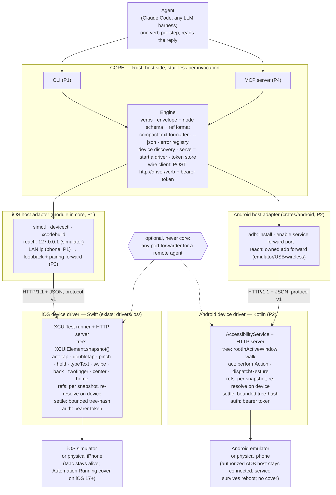

# agent-mobile — Product Requirements Document

Status: draft v0.3, 2026-10-05. Owner: Lahfir. Language: Rust (host), Swift (iOS driver), Kotlin (Android driver).
Evidence base: `docs/research/` (13 tracks), `docs/experiments/RESULTS.md` (Experiments 1–10, verbatim).

## 0. Summary

agent-mobile is a CLI that lets an AI agent drive iOS and Android apps the way agent-browser drives
the web: take a snapshot of the accessibility tree, act on an element by reference, take the next
snapshot. The driver runs on the device or simulator and speaks plain HTTP on a local port; the Rust
CLI is a stateless client. The loop is proven end to end on the iOS simulator, a physical iPhone
over Wi-Fi (Experiments 5–9), and the Android 17 emulator (Experiment 10). The physical Android leg
was not run because no authorized phone was available. This document turns those probes into a
product in four phases and names the one gate that decides whether the product should exist at all:
a measured reliability win over Maestro MCP and mobile-mcp on identical tasks.

## 1. Problem

Agents can already drive a phone. Maestro ships an MCP server, mobile-mcp exists, and Appium has
MCP wrappers. What none of them ships is a contract an agent can rely on: element references that
fail loudly when stale instead of tapping the wrong thing, a bounded settle check instead of an
unbounded "wait for idle", and one action that returns the next tree instead of a find-then-act
round trip. The research track on prior art lists settle detection and reference stability as
unsolved industry-wide, and every published reliability number in the space is an unaudited
self-report (docs/research/09 §8, docs/research/11). Physical iOS is the weakest link everywhere:
Maestro states it is not supported; mobile-mcp needs a USB-trusted device (docs/research/09). We did
the full loop over Wi-Fi with one script (Experiments 7 and 8).

## 2. Users

1. An AI coding agent (Claude Code, Codex, Cursor, any harness) driving a mobile app step by step.
   It reads one compact snapshot per step and issues one verb. The only user in P1–P3.
2. A developer running that agent against their own app on a simulator, an emulator, or their own
   phone. They install the CLI, start one driver, and hand the agent the tool.

## 3. Goals and non-goals

Goals
- One contract across iOS and Android: one envelope, one node schema, and `@<snapshot_id>:eN` refs.
- Fail-loud references: every action re-resolves on the device; a stale or ambiguous target is an
  error, never a guess.
- Bounded waits: every action settles with a finite cap and reports what it saw.
- Minimal setup: one binary and one driver per platform, no Appium server or capabilities file;
  Android uses only a pinned headless SDK, never Android Studio.
- Local by default: iOS simulator and every Android endpoint are loopback; the physical-iOS LAN
  listener is the documented P1 exception.
- Simulator/emulator and physical devices over their supported local transports: iOS LAN and
  authorized Android USB or wireless ADB.
- Measured reliability, published with seed variance.
- No hidden retry and no fuzzy match, anywhere.

Non-goals
- Replacing Appium or Maestro for scripted regression suites. Breadth is theirs.
- Cloud device farms, WebView/CDP bridging, games and canvas UIs (vision-only territory).
- Tunnels, relays, and QR pairing as product code. A tunnel is a documented adapter script.
- Self-healing locators. No production framework ships them and none publishes accuracy (docs/research/11).
- A daemon or hub in the core. The driver is the long-lived process; the CLI is stateless.
- Play Store or App Store distribution of the agent pieces (docs/research/10).

## 4. Architecture


```mermaid
flowchart TB
    AGENT["Agent<br/>(Claude Code, any LLM harness)<br/>one verb per step, reads the reply"]

    subgraph CORE["CORE — Rust, host side, stateless per invocation"]
        direction TB
        CLI["CLI (P1)"]
        MCP["MCP server (P4)"]
        ENGINE["Engine<br/>verbs · envelope + node schema + ref format<br/>compact text formatter · --json · error registry<br/>device discovery · serve = start a driver · token store<br/>wire client: POST http://driver/verb + bearer token"]
        CLI --> ENGINE
        MCP --> ENGINE
    end

    subgraph IOSHOST["iOS host adapter (module in core, P1)"]
        IOSA["simctl · devicectl · xcodebuild<br/>reach: 127.0.0.1 (simulator)<br/>LAN ip (phone, P1) → loopback + pairing forward (P3)"]
    end

    subgraph ANDHOST["Android host adapter (crates/android, P2)"]
        ANDA["adb: install · enable service · forward port<br/>reach: owned adb forward (emulator/USB/wireless)"]
    end

    TUNNEL{{"optional, never core:<br/>any port forwarder for a remote agent"}}

    subgraph IOSDRV["iOS device driver — Swift (exists: drivers/ios/)"]
        IOSD["XCUITest runner + HTTP server<br/>tree: XCUIElement.snapshot()<br/>act: tap · doubletap · pinch · hold · typeText · swipe · back · twofinger · center · home<br/>refs: per snapshot, re-resolve on device<br/>settle: bounded tree-hash<br/>auth: bearer token"]
    end

    subgraph ANDDRV["Android device driver — Kotlin (P2)"]
        ANDD["AccessibilityService + HTTP server<br/>tree: rootInActiveWindow walk<br/>act: performAction · dispatchGesture<br/>refs: per snapshot, re-resolve on device<br/>settle: bounded tree-hash<br/>auth: bearer token"]
    end

    IOSDEV["iOS simulator<br/>or physical iPhone<br/>(Mac stays alive; Automation Running cover on iOS 17+)"]
    ANDDEV["Android emulator<br/>or physical phone<br/>(authorized ADB host stays connected; service survives reboot; no cover)"]

    AGENT --> CLI
    AGENT --> MCP
    ENGINE --> IOSA
    ENGINE --> ANDA
    IOSA -- "HTTP/1.1 + JSON, protocol v1" --> IOSD
    ANDA -- "HTTP/1.1 + JSON, protocol v1" --> ANDD
    TUNNEL -.-> IOSD
    TUNNEL -.-> ANDD
    IOSD --> IOSDEV
    ANDD --> ANDDEV
```

Component rules
- The driver owns the tree, the refs, the settle, and the auth, because the live tree is there.
  The core owns the contract, the formatting, process control, and the wire client.
- The core never parses a tree beyond formatting it. Ref resolution runs on the device.
- One driver process per device, one port each. The CLI maps device to port through a small state
  file under `~/.agent-mobile/`.
- Today's iOS driver (`drivers/ios/Driver/AgentMobileServer.swift`, 267 lines) is the P1
  driver as is, plus a Home press at start on the simulator. The host app in that project is a
  minimal shell the UI-test target needs; the driver never touches it.
- Physical iOS needs a host process (the Mac) alive for the session (docs/research/02). The agent
  never needs the phone screen; the tree and the screenshot endpoint carry the state.

## 5. Contract

### 5.1 Wire protocol

Every call is an HTTP/1.1 `POST /<verb>` request with a JSON body, `Authorization: Bearer <token>`, and `Connection: close`. The CLI sends protocol version `1` as `X-Agent-Mobile-Version`; both drivers refuse a mismatch with `BAD_REQUEST`, the nearest fit.

“Settled snapshot” below means `data: {app, snapshot_id, ref_count, complete, settled, reads, text, tree}`:

| Verb | Body params | Returns | Notes |
|---|---|---|---|
| `status` | none | `app, snapshot_id, device, os` | No tree, no settle step. |
| `launch` | `bundle_id` | settled snapshot | Cold-launches the app; it becomes the active bundle. |
| `terminate` | none | `terminated: app id` | Only verb whose reply is not a settled snapshot. |
| `snapshot` | `app?` | settled snapshot | iOS targets the named bundle; Android validates that the package is already foreground. |
| `tap` | `ref`, or `x` and `y` | settled snapshot | `x,y` are points from the app frame's top-left corner, not a 0-1 fraction. |
| `type` | `text`, `ref?` | settled snapshot | Taps `ref` first if given, else types into current focus. |
| `swipe` | `direction`, `ref?` | settled snapshot | `direction` is one of up/down/left/right, else `BAD_REQUEST`; swipes `ref` if given, else the whole app. |
| `home` | none | settled snapshot | Goes to SpringBoard on iOS or the active launcher on Android. |
| `doubletap` | `ref`, or `x` and `y` | settled snapshot | Target required; shapes mirror `tap`. |
| `pinch` | `ref`, `scale`, `velocity?` | settled snapshot | `ref` required; `scale` positive, finite, `\|scale - 1\| >= 0.01`, else `BAD_REQUEST`; `velocity` defaults to sign-matched 1.0. |
| `hold` | `ref` or `x` and `y`, `duration?` | settled snapshot | Target required; `duration` defaults to 1.0 and must satisfy 0 < d <= 10 (press plus settle must fit the wire budget), else `BAD_REQUEST`; a present-but-wrong-type duration is `BAD_REQUEST`, not the default. |
| `back` | none | settled snapshot | System edge swipe; no target. Works in navigation stacks; web-history back is unproven. |
| `twofinger` | `ref` | settled snapshot | `ref` required. Elements XCTest cannot address (e.g. widgets) fail as `DRIVER_ERROR`; the driver stays up. |
| `center` | `which` | settled snapshot | `which` takes only `notification`, opening iOS Notification Center or the Android notification shade; any other value is `BAD_REQUEST`. Earlier app refs die. |
| `screenshot` | none | `png_base64` | No settle step; not a tree snapshot. |

**Envelope.** Success returns `{version, ok, command, elapsed_ms, data}`; failure returns the same shape with `ok:false` and `error:{code, message}` in place of `data`; a 401 for a bad token omits `command` and `elapsed_ms`, returned before the command dispatches. `version` is fixed at `1` on both platforms and changes only with a breaking contract change. The error object carries `code` and `message` only. Error codes: `STALE_REF, AMBIGUOUS_TARGET, BAD_REQUEST, UNKNOWN_COMMAND, UNAUTHORIZED, DRIVER_ERROR`; status and agent behavior per code are in §5.3.

**Node.** Every node carries a `ref_id`, because mobile trees have tappable unnamed containers; the text listing prints only named or interactive nodes, so token cost is unchanged. Every node carries `bounds` as `{x, y, width, height}`. `native_id.kind` is `ax_identifier` on iOS and `resource_id` on Android; Compose `test_tag` extraction remains Later.

**Text listing.** The driver's `Accept: text/plain` path returns a header line plus one line per named or interactive node, useful directly against the driver (`am.sh`, curl). The core owns the text formatter: the CLI always requests JSON and renders the same line format itself, including for `status`, `terminate`, and `screenshot`. From a live run against Calendar:

```
app=com.apple.mobilecal snapshot=@upii2see refs=127 settled=true reads=2 elapsed_ms=5101
@upii2see:e1 application "Calendar" at=0,0 size=440x956
```

**Settle.** After every action or snapshot, the driver re-reads the tree every 150 ms, hashing each node's type, integer frame, label, identifier, and value, until two consecutive reads match or 3 s pass. `settled` reports which happened; `reads` reports how many tries; a `settled: false` reply still returns the last, usable, read.

**Refs.** Refs are minted per snapshot as `@<snapshot_id>:e<N>`. Each settled snapshot discards every prior ref before minting new ones, so a ref resolves only against the snapshot that produced it. An action re-resolves its ref against the live tree by element type, accessibility identifier, label, and frame, allowing at most 1 pt of difference in x, y, width, and height. A snapshot-id mismatch or zero live matches returns `STALE_REF`; more than one live match returns `AMBIGUOUS_TARGET`; the driver never guesses. Example: a ref taken on the empty Title field dies once text goes in, because the label changes from the placeholder to the identifier and the width shrinks (Experiment 8). That is the contract at work: re-snapshot after any action that changes the target.

### 5.2 CLI surface

The CLI is stateless per call against the long-lived driver. Fourteen of the eighteen commands
below map to a same-named driver verb; `devices`, `serve`, and `skills` have none, and `stop`
sends `terminate`.

| Command | Args | Wire call | Notes |
|---|---|---|---|
| `devices` | none | none | Lists normalized iOS simulators/phones and Android AVD/USB/wireless targets; CLI-side only. |
| `serve` | `<device>` | starts driver | Runs in the foreground for a name, id, or `platform:id`; prints the token and URL once. `--app` pre-launches an app. |
| `status` | none | `status` | |
| `snapshot` | none | `snapshot` | `--app` follows the platform semantics above; `--max-depth` trims client-side and marks `complete:false`. |
| `tap` | `<ref>`, or `<x> <y>` | `tap` | One argument is read as `ref`; two are read as `x y`. |
| `type` | `[ref] <text>` | `type` | A leading argument shaped like `@<id>:eN` is consumed as `ref`; remaining arguments join into `text`. |
| `swipe` | `<direction> [ref]` | `swipe` | `direction`: up, down, left, or right. |
| `home` | none | `home` | |
| `doubletap` | `<ref>`, or `<x> <y>` | `doubletap` | One argument is read as `ref`; two are read as `x y`. |
| `pinch` | `<ref> <scale> [--velocity <V>]` | `pinch` | `scale` above 1 zooms out, below 1 zooms in; near-1 or non-positive scales are `BAD_REQUEST` driver-side; non-finite scale/velocity fail client-side. Unaddressable elements fail as `DRIVER_ERROR`; the driver stays up. |
| `hold` | `<ref>`, or `<x> <y>`, `[--duration <SECS>]` | `hold` | `duration` defaults to 1.0 and must satisfy 0 < d <= 10 (`BAD_REQUEST` from the driver); the CLI sizes its wire timeout from the duration. |
| `back` | none | `back` | |
| `twofinger` | `<ref>` | `twofinger` | |
| `center` | `<notification>` | `center` | Only `notification` exists today. |
| `launch` | `<app_id>` | `launch` | Sends the shared wire field `bundle_id`. |
| `screenshot` | `[output-path]` | `screenshot` | Decodes `png_base64`; writes to `output-path`, or stdout if omitted. |
| `stop` | none | `terminate` | |
| `skills` | none | none | Prints the bundled one-page agent guide. |

Wire calls are read from the driver. `devices`, `serve`, and the argument shapes are new CLI specification.

**Flags and environment.** `--app` carries an app selector: iOS `snapshot` targets the bundle, Android `snapshot` only validates the foreground package, and `serve --app` launches it after binding. `--max-depth` applies to every settled-snapshot verb and lives in the core: the driver returns the full tree, the core drops nodes below the depth and sets `complete: false`. `--device` accepts a name, raw id, or collision-free `platform:id` key and is remembered. `AGENT_MOBILE_URL` and `AGENT_MOBILE_TOKEN` override the saved address and token.

**Exit codes.** `0` ok, `1` error envelope (including a `DRIVER_ERROR` the CLI synthesizes for a transport failure with no envelope at all), `2` usage error.

### 5.3 Error registry

HTTP status per code is read from the driver's response builder.

| Code | HTTP status | Meaning | What the agent should do |
|---|---|---|---|
| `STALE_REF` | 409 | The ref's snapshot id does not match the current snapshot, or no live element matches it. | Re-snapshot, then retry the action with a fresh ref. |
| `AMBIGUOUS_TARGET` | 409 | More than one live element matches the ref's identity evidence. | Re-snapshot with a narrower root, or use a ref with a firmer `native_id`, then retry. |
| `BAD_REQUEST` | 409 | A required body field is missing, or a value like `direction` is invalid. | Fix the request; do not retry unchanged. |
| `UNKNOWN_COMMAND` | 409 | The path does not match a known verb. | Fix the client; do not retry. |
| `UNAUTHORIZED` | 401 | The bearer token is missing or wrong. | Fix `AGENT_MOBILE_TOKEN`; do not retry unchanged. |
| `DRIVER_ERROR` | 500 | An error the driver did not anticipate. | Retry once; escalate if it recurs. |

## 6. Phases

### 6.0 P0 — Research and probes (complete)

P0 is the first phase and it is finished. What it proved:

- Research: 13 tracks, synthesized in `docs/research/README.md`.
- Experiment 5, simulator: an agent created a Calendar event by ref with no scripted steps; a stale ref was rejected in 4 ms.
- Experiment 6, tunnel: the same driver through a public URL; settled snapshot in 393 ms; 401 without the token.
- Experiments 7 and 8, physical iPhone 14 Pro over Wi-Fi: the full Calendar loop in four calls of 1.8 to 2.3 s each; status in 0.076 s on the LAN; one STALE_REF in Experiment 7 with an unknown trigger, none in Experiment 8.

### 6.1 P1 — Rust CLI and core, iOS only

**Scope**
- P1 wraps the existing, already-proven Swift driver (§6.0) in a Rust CLI plus core.
- It runs on the simulator and an iPhone on the same network.
- Verb set: devices, serve, status, snapshot, tap, doubletap, pinch, hold, back, twofinger, center, type, swipe, home, launch, screenshot, stop.
- Text output by default; `--json` gives JSON.
- Each session's token is stored under `~/.agent-mobile`.
- Driver cleanups: envelope version `1`, `X-Agent-Mobile-Version` check, `bounds` keys renamed to `{x,y,width,height}`, Home press at start on the simulator, no default token in any script.
- `serve` recognizes the "certificate is not trusted" launch failure and prints the re-trust steps (Experiment 8).
- Developer experience, the P1 acceptance bar: `npm i -g agent-mobile` then `agent-mobile snapshot` is the whole start. The first verb starts the driver if none runs (lazy start), boots the default simulator, saves the session under `~/.agent-mobile/`, and then runs the verb. `serve` stays as the explicit form.
- The npm package ships a prebuilt simulator runner, so the simulator path builds nothing on the user's Mac (Maestro's pattern, docs/research/09 §5). A physical iPhone builds and signs once with the Xcode account on that Mac; `--device <name>` is remembered.
- Every error names the next action: a stale ref says re-snapshot, a missing Xcode says the install step, a missing simulator says the create command, a trust refusal says the three Settings steps.
- `agent-mobile skills` prints the one-page agent guide.

**Out of scope**
- Android, the in-app SDK, the benchmark, and the MCP wrapper wait for later phases.

**Exit criterion** — Experiment 9: the CLI creates a Calendar event on the simulator and the phone, verbatim; the driver presses Home first on the simulator so no runner screen shows. The simulator run starts from a clean machine state with only `npm i -g agent-mobile` and no `serve` call.

### 6.2 P2 — Android device driver (emulator exit proven)

**Scope**
- Android has a Kotlin `AccessibilityService` driver using protocol version 1.
- The Rust host adapter installs/provisions it, verifies explicit accessibility consent, owns one
  exact ADB forward plus a loopback lifecycle bridge, and cleans only those owned resources.
- Emulator, USB, and wireless targets share the normalized discovery/session path. Experiment 10
  proved the emulator; no authorized physical Android phone was available for that run.
- Android nodes use `native_id.kind = resource_id`.

**Out of scope**
- Compose `testTag` support and instrumentation/Shizuku wait for Later; Play listing is permanently out (§6.5).

**Exit criterion** — Experiment 10: an alarm created in the Clock app through the public CLI,
verbatim. The emulator leg passed. The conditional phone leg is explicitly not run, with its exact
manual procedure retained, rather than represented by a synthetic transcript.

### 6.3 P3 — Reliability gate

**Scope**
- The §9 benchmark runs agent-mobile against Maestro MCP and mobile-mcp.
- A third read or a minimum settle window fixes the early-settle case in §8.
- A springboard/system-alert surface handles permission dialogs; `scroll_until_visible` ships.
- Physical-iOS hardening moves the bind to loopback plus a pairing-channel port forward.

**Benchmark report** — `scripts/bench.py` (runner) and `scripts/bench.html` (template) are the base for the §9 run and every later benchmark. Extend them; do not fork them. Keep the report standard:
- One question per 1280×720 slide, each a white card on the patterned ground that can be posted as a screenshot. Nothing may overflow the card.
- Numbers left, one chart right. The footer on every slide carries version, device, OS, SHA, runs, and date.
- Charts use the reference shapes only: rounded stacked bars, rounded columns with one saturated highlight, the ribbon waterfall, the gapped donut, and thin spark bars. The key value sits in a black chip.
- Palette in fixed order: `#4F55F0`, `#E0584F`, `#8B5CF6`, `#D4861A`, `#D946C8`. Text stays in ink or muted grey, never the series color.
- Titles are short questions. No paragraphs. Every value also appears in the "All numbers" table.
- A competitor run adds its series to the existing slides; it does not add new slide types.

**Out of scope**
- Everything in §6.5's Later and Never lists.

**Exit criterion** — Experiment 11: the benchmark completes across all tasks and seeds against both competitors, and §9's kill criterion applies to the pooled result.

### 6.4 P4 — MCP server and release

**Scope**
- An MCP server wraps the same verbs over the same core; nothing new.
- The skills doc ships bundled.

**Out of scope**
- Any verb the CLI does not already expose.

**Exit criterion** — Experiment 12: after publishing to npm and cargo, a stock MCP client repeats Experiment 9's Calendar event through the MCP server.

### 6.5 Later / Never

**Later**
- The iOS in-app SDK, a zero-host rail for a developer's own app.
- Compose `testTag` read via `refreshWithExtraData` in the Android service.
- List dedup in the text snapshot.
- Instrumentation/Shizuku for permission grants and rotation.

**Never**
- Self-healing locators.
- A hub or daemon in the core.
- A QR pairing flow on the XCUITest rail.
- Tunnel logic in the code; tunnels stay a documented adapter script.
- A Play Store listing of the Android agent.

## 7. Engineering practices

### 7.1 Workspace and layout

```
agent-mobile/
├── Cargo.toml
├── crates/core/       # shared contract, wire client, state, process, iOS host adapter
├── crates/android/    # ADB discovery, lifecycle bridge, forwarding, session ownership
├── src/               # CLI plus normalized platform discovery/runtime
├── scripts/           # source gates, SDK setup, fixture capture, CI emulator lifecycle
├── drivers/ios/       # Swift XCUITest driver
├── drivers/android/   # Kotlin AccessibilityService and checked-in Gradle wrapper
└── docs/              # research tracks, experiments, this PRD
```

Platform branching is normalized under `src/platform/`. Individual verbs parse arguments, build
JSON, and call the same wire; only discovery, `serve`, and lazy startup own platform-specific
lifecycle work. There is no `crates/ios`; the iOS host adapter and shared contract stay in
`crates/core`.

Toolchain: Rust 1.89.0, pinned in `rust-toolchain.toml`, with clippy and rustfmt. License: Apache-2.0.

Dependencies stay small: `clap`, `serde`, `serde_json`, and blocking HTTP through `ureq` or a
`std::net::TcpStream` with `Connection: close`. No async runtime.

### 7.2 Rust source rules

There is no Rust port of the JavaScript "anti-slop" oxlint ruleset. This list is its equivalent for
this repo.

- clippy runs the pedantic group at warn, plus a small deny list. CI runs `cargo clippy --all-targets -- -D warnings`.
- `cognitive_complexity` is enabled, with `cognitive-complexity-threshold = 12` in `clippy.toml`.
- `too_many_lines` is enabled, with `too-many-lines-threshold = 100`.
- Hard limit: 400 lines per `.rs` file. clippy has no file-length lint, so a script enforces it in CI and in the pre-commit hook.
- No inline `//` or `/* */` comments. Only `///` and `//!` doc comments. The same script enforces this.
- A doc comment is at most 15 lines per item. The same script enforces this.
- CI runs `cargo fmt --check` and `cargo deny check`.
- Test rules in the same script: every `#[test]` asserts, no `sleep` in a test, `#[ignore]` needs a reason. Core tests compare against fixtures recorded from real driver output, so a test cannot re-implement the code it checks. P1 adds `cargo-mutants` on changed files, the only mechanical proof that a test fails when the code breaks.

### 7.3 Testing

Core testing has three kinds.

| Kind | Proves | Needs a live target |
|---|---|---|
| Unit tests | the text formatter and ref parsing | no |
| Golden fixture tests (in-crate) | the core parses real iOS and Android driver JSON correctly | no |
| Platform integration tests | the public CLI starts, snapshots, and cleans a real platform session | yes |

Fixtures are recorded from live drivers, never hand-written, so the core stays testable without a
device. `tests/integration_snapshot.rs` covers iOS; `tests/integration_android.rs` covers
concurrent lazy startup, real Android verbs, screenshot decoding, exact-forward cleanup, and
re-serve.

### 7.4 CI

CI has three jobs. Physical devices are never in CI.

| Job | Runner | Steps | Gate |
|---|---|---|---|
| `lint-and-test` | `ubuntu-latest` | format, clippy, source rules, workspace tests, dependency policy | any step failing blocks merge |
| `simulator-integration` | `macos-26` | build the iOS driver; run ignored `integration_snapshot` | the live snapshot assertion must pass |
| `android-emulator` | `ubuntu-latest` | install only missing pinned headless SDK pieces; build/lint/test the APK; boot the disposable API 37 AVD; run ignored `integration_android`; always clean owned resources | the complete public-CLI Android rail must pass |

Workflow hygiene: `permissions: {}` at the top, per-job `contents: read`, SHA-pinned actions, a
`timeout-minutes` per job, and `--locked` on every cargo command.

### 7.5 Release and versioning

Releases run through release-please. Conventional Commit titles drive the version bump and the
changelog. The binary crate publishes to crates.io and npm wraps the prebuilt binary; `crates/core`
stays `publish = false`. The npm package points `bin` at a JS shim, runs a `postinstall` script,
and sets `engines.node >=18`.

The protocol version stays independent of the crate version. A breaking protocol change needs a
`feat!:` title or a `BREAKING CHANGE:` footer, bumps the envelope version string, and ships the
driver and CLI together in one release.

### 7.6 Security policy

- A token is required on every route. iOS simulator and Android are loopback-only; physical iOS is
  the documented P1 LAN exception. No tunnel logic lives in the core (§3 non-goals).
- A fresh token is provisioned per `serve`, stored under `~/.agent-mobile/` at mode `0600`; no
  script carries a default.
- Logs may keep the command name, `elapsed_ms`, and the ok/error outcome, never the token.
- `SECURITY.md` states the scope: the CLI, the core, and the drivers.
- Fixture and curl helpers pass bearer headers through private files rather than argv.

### 7.7 Definition of done for any phase

1. The phase-relevant `lint-and-test`, iOS simulator, and Android emulator CI gates (§7.4) pass.
2. An Experiment entry in `docs/experiments/RESULTS.md` records verbatim output.
3. No token or secret appears in logs, diffs, or committed scripts.
4. `README.md` and the relevant `docs/` file reflect any command or protocol change.

## 8. Performance budget

Measured on the physical iPhone (Experiments 7 and 8): `status` costs 0 to 2 ms driver-side, so
the wire is not the cost. One `XCUIElement.snapshot()` costs about 205 ms on the device and about
122 ms on the simulator. A 2,059 ms `tap` breaks down as:

| Part | ms | Cause |
|---|---|---|
| resolve: `q.count` | 205 | full tree evaluation |
| resolve: `element(boundBy:)` | 205 | the same query evaluated a second time |
| `.tap()` | ~1090 | Apple's automatic quiescence wait inside every XCUITest interaction |
| settle: two snapshots | 410 | two full tree reads |
| settle: fixed `usleep` | 150 | the driver's own pause between reads |

P1 fixes, in payoff order: turn off the quiescence wait as WebDriverAgent does
(docs/research/01); resolve from one snapshot and tap the matched frame by coordinate instead of
evaluating the query twice; drop the fixed pause, since a snapshot already takes longer than it;
reuse the post-action read as the first settle read. Target: about 700 ms per action on a device
and about 450 ms on the simulator. A `--fast` single-read mode that reports `settled: false`
reaches about 300 ms. Below 200 ms is not reachable on a physical device while returning a full
tree, because one tree read is Apple's floor; a depth cap pushed into the driver is the only
further lever.

## 9. Risks

| Risk (evidence) | Mitigation | Phase |
|---|---|---|
| Settle check fires early on a device; two matching reads 150 ms apart while a layout pass was pending (Exp 7, not reproduced in Exp 8, trigger unknown) | Third read or a minimum settle window | P3 |
| "Automation Running" cover on physical iOS 17+ for the whole session (Exp 7) | Inherent to the XCUITest rail; only the in-app SDK rail avoids it | Later |
| A host must stay alive for physical iOS: pairing, DDI mount, launch handshake, keep-alive (docs/research/02) | The Mac runs xcodebuild for the whole session | P1 |
| Plain HTTP on the LAN hop and a 0.0.0.0 bind on the phone (README) | Loopback bind plus a pairing-channel port forward | P3 |
| Compose `testTag` is invisible unless the service calls `refreshWithExtraData` (docs/research/08) | P2 ships without it; the service adds the call later | Later |
| Play policy bans autonomous use of the accessibility API since November 2025 (docs/research/05, 10) | Sideload, GitHub release, or enterprise channel; never Play | P2 |
| One `UiAutomation` owner per device if instrumentation is added (docs/research/06, 09) | Instrumentation and Shizuku stay an optional add-on, never the base rail | Later |
| Developer certificate trust lapsed after about an hour; runner refused to launch until re-trusted (Exp 8, n=2) | `serve` prints the re-trust steps; a paid profile removes the gate | P1 |
| Field reliability numbers are unaudited; one paper measured 26 to 33 percent seed swings (docs/research/09 §8) | Report the benchmark's seed variance with the mean | P3 |

## 10. Success metrics

The P3 benchmark is the reliability gate: ship or stop turns on its result.

| Parameter | Value |
|---|---|
| Platform | Simulator and emulator only. Maestro's own README states plainly that physical iOS devices are not yet supported, including through its MCP server. A shared task set needs every tool able to attempt every task, so physical iOS is out of the comparison even though agent-mobile itself can run it (§6.0). |
| Tasks | 10, identical across all three tools |
| Seeds | at least 5 per task per tool |
| Model | one fixed model, held constant across agent-mobile, Maestro MCP, and mobile-mcp |
| Tools compared | agent-mobile vs. Maestro MCP vs. mobile-mcp |
| Metrics | task success rate, steps per task, STALE_REF count, wall time |

Report each metric as a mean and spread across seeds, per task and pooled.

Kill criterion, verbatim: "if agent-mobile is not measurably more reliable than both competitors on the same tasks, stop the product and contribute the ref and settle contract upstream."

## 11. Known limitations

- Physical iOS needs a Mac with Xcode alive for the whole session, a paired device, Developer Mode,
  and a trusted developer certificate. No cable after pairing. No zero-host mode on this rail.
- Physical iOS shows the system "Automation Running" cover for the whole session. Not removable.
- The Developer certificate trust on the phone lapsed after about an hour in Experiment 8. Expect a manual re-trust step until a paid profile is used.
- The two-read settle check can declare "settled" while a late layout pass is still pending on a
  device (Experiment 7). The fail-loud ref check catches it; P3 tightens it.
- The phone driver binds all interfaces on the LAN in P1. The token is the only gate on that hop.
  P3 replaces it with a loopback bind and a pairing-channel forward.
- Canvas, games, and opaque WebViews expose no tree. Vision is out of scope.
- Android: the agent app is sideload only. Play policy bans this use of the accessibility API.
- Physical Android requires user-authorized USB or wireless ADB plus explicit Accessibility and,
  on affected releases, Restricted Settings consent. Experiment 10's physical leg remains not run
  until an authorized phone is available.

## 12. Open question

License: Apache-2.0 is assumed. Owner's call.

## Appendix A. Evidence index

| Claim | Where |
|---|---|
| macOS AX cannot see inside the simulator | `docs/experiments/RESULTS.md` Exp 1 |
| XCUITest reads a 179-element tree, 1.10 s cold / 0.66 s warm | Exp 3 |
| Agent-driven drive loop on the simulator, Calendar event created | Exp 5 |
| Driver through a cloudflared tunnel, 0.45 s status, 0.51 s snapshot | Exp 6 |
| Physical iPhone 14 Pro over Wi-Fi and public URL; STALE_REF fired and held | Exp 7 |
| Full loop on the phone over the LAN, event created, no STALE_REF; trust lapse observed | Exp 8 |
| Shipped iOS CLI exits P1 on simulator and phone | Exp 9 |
| Android 17 emulator creates and verifies a Clock alarm through the public CLI | Exp 10 |
| Physical Android Experiment 10 leg was unavailable, with no synthetic evidence | Exp 10 |
| Physical iOS cannot be zero-host | `docs/research/02-ios-connectivity.md` §7 |
| Settle and ref stability unsolved industry-wide | `docs/research/09` §8, `docs/research/11` |
| Android rail: AccessibilityService companion, survives reboot | `docs/research/05`, `docs/research/09` |
| Policy: sideload only, no store listing | `docs/research/05`, `docs/research/10` |
