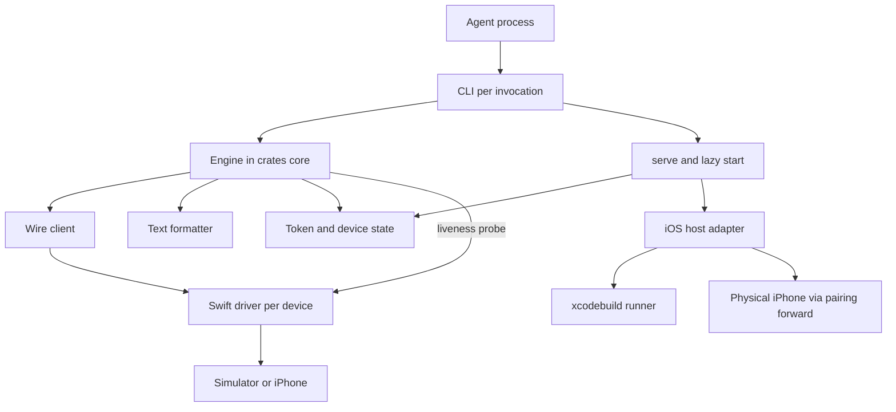
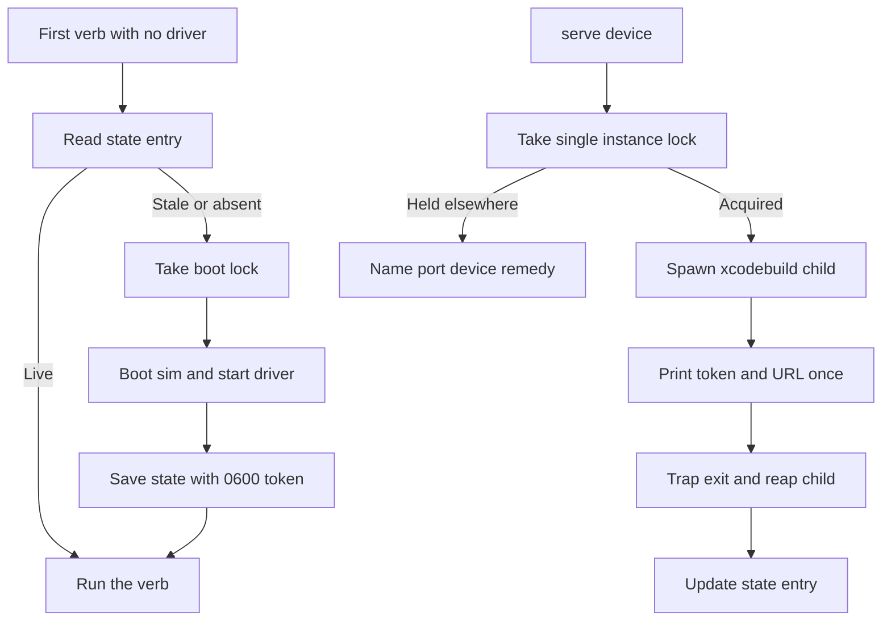

# P1 iOS CLI and Core - Plan

## Goal Capsule

- **Objective:** Build P1 of `docs/PRD.md` §6.1: a Rust CLI plus core wrapping the proven Swift driver, iOS only, simulator plus same-network iPhone, with the driver's listed cleanups and the exit criterion recorded verbatim.
- **Authority:** `docs/PRD.md` §§4–7 governs product scope. This plan adds one owner-approved scope change (the `activate` command). Research findings constrain mechanism. Contradictions resolve toward the PRD unless a KTD names the deviation.
- **Stop conditions:** Experiment 9 passes verbatim on both targets. Both CI gates pass. No token or secret appears in logs, diffs, or committed scripts.
- **Execution profile:** Greenfield build across Rust core, CLI, Swift driver cleanups, npm packaging, and CI. Ten units in four phases. No existing behavior to preserve.
- **Tail ownership:** `ce-work` or equivalent executor owns sequencing within the dependency order below.

---

## Product Contract

### Summary

This plan builds the P1 Rust CLI and core against the existing Swift driver, covering the full §6.1 scope plus an owner-approved `activate` command, with fail-loud refs, bounded settle reporting, lazy start from a clean machine, and a darwin-only npm package.

### Problem Frame

Agents can already drive phones through Maestro MCP, mobile-mcp, or Appium wrappers. None of them ships a contract an agent can rely on: refs that fail loudly instead of tapping the wrong element, a bounded settle check instead of unbounded idle wait, and one action returning the next tree instead of a find-then-act round trip. The probe loop already proved the contract end to end on the iOS 26 simulator and a physical iPhone 14 Pro over Wi-Fi. P1 turns that probe into a product: a stateless Rust CLI over a long-lived device driver, one envelope and one node schema, measured later at the P3 reliability gate.

### Actors

- A1. AI coding agent. The only P1–P3 user. Reads one compact snapshot per step and issues one verb.
- A2. Developer. Installs the CLI, starts one driver, hands the agent the tool. Performs the human-only steps: Xcode cert trust, same-Wi-Fi placement, foreground `serve`.

### Requirements

**Contract and wire (per §5.1)**

- R1. Envelope shape is fixed. Success returns `{version, ok, command, elapsed_ms, data}`. Failure returns the same shape with `error:{code, message}` in place of `data`. A 401 for a bad token omits `command` and `elapsed_ms`. `version` is `"1"` for P1.
- R2. Error codes are `STALE_REF, AMBIGUOUS_TARGET, BAD_REQUEST, UNKNOWN_COMMAND, UNAUTHORIZED, DRIVER_ERROR`. Agent behavior per code follows §5.3: re-snapshot on stale, fix-and-never-blind-retry on bad requests and auth, retry once on driver errors.
- R3. Refs are minted per snapshot as `@<snapshot_id>:e<N>`. Each settled snapshot discards prior refs. Actions re-resolve on the device by type, identifier, label, and frame within 1 pt. Zero matches give `STALE_REF`. Multiple matches give `AMBIGUOUS_TARGET`. The driver never guesses.
- R4. Settle re-reads the tree every 150 ms and hashes type, integer frame, label, identifier, and value until two consecutive reads match or 3 s pass. `settled` and `reads` are reported. A `settled:false` reply stays usable.
- R5. Nodes carry `ref_id` and `bounds:{x, y, width, height}`. `native_id.kind` is `ax_identifier` in P1. The text listing prints named or interactive nodes only.
- R6. Wire calls are `POST /<verb>` with JSON body, `Authorization: Bearer <token>`, `Connection: close`, and `X-Agent-Mobile-Version: 1`. A mismatched driver refuses with `BAD_REQUEST`.

**CLI surface (per §5.2, plus the approved addition)**

- R7. Twelve commands ship: `devices`, `serve`, `status`, `snapshot`, `tap`, `type`, `swipe`, `home`, `launch`, `activate`, `screenshot`, `stop`, plus a `skills` guide page. `devices` and `serve` are CLI-side only. `stop` sends `terminate`. `activate` foregrounds a running app without relaunch and is the one addition beyond the PRD text.
- R8. `tap` takes a ref or an `x y` point pair from the app frame's top-left. `type` takes an optional leading ref plus free text. `swipe` takes a direction plus an optional ref and rejects other directions before any round trip. `launch` cold-starts a bundle. `screenshot` writes to a path or stdout.
- R9. `--app` selects the bundle. `--max-depth` trims client-side and flips `complete` to false. `AGENT_MOBILE_URL` and `AGENT_MOBILE_TOKEN` override the state file per invocation. `--device <name>` is remembered.
- R10. Output is terse text by default with `--json` passthrough. Exit codes are 0 ok, 1 error envelope, 2 usage error. Every error names the next action. Error codes appear verbatim in text output.

**Sessions and devices (per §§4, 6.1, 7.6)**

- R11. Each session's token is generated fresh and stored under `~/.agent-mobile` with restrictive permissions. No script carries a default token. Logs keep command name, timing, and outcome only.
- R12. Lazy start works: the first verb with no running driver boots the default simulator, saves the session, and runs the verb. Explicit `serve` stays available.
- R13. `serve` recognizes the certificate-not-trusted launch failure and prints the re-trust steps. Mid-session death from trust lapse, Wi-Fi change, or Mac sleep produces a specified escalation stanza. Re-trust stays human-only.
- R14. `stop` ends the app bundle and leaves the driver up. Serve owns driver-process teardown and state cleanup. Port conflicts name the holder and the remedy.

**Packaging and quality (per §§6.1, 7.3–7.5)**

- R15. `npm i -g agent-mobile` then `agent-mobile snapshot` is the whole start. The npm package ships a prebuilt simulator runner so the simulator path builds nothing. A physical iPhone builds and signs once with the Xcode account on that Mac.
- R16. Core testing is unit tests, in-crate golden fixture tests from recorded driver JSON, and one simulator-booting integration test at `tests/integration_snapshot.rs`.
- R17. CI runs `lint-and-test` on ubuntu plus `simulator-integration` on macOS. Physical devices stay out of CI.
- R18. The fixture-script cleanups land: no default token in `am.sh`, restrictive token-file permissions in `start-device.sh`, plus the driver cleanups in R19.
- R19. Driver cleanups are exactly: envelope version `1`, the version-header check, `bounds` renamed to `{x, y, width, height}`, Home press at start on the simulator, no default token, bundle reset to springboard on `terminate`, and the re-trust recognition in `serve`. The last two extend the PRD's list per KTD10 and KTD13.

### Key Flows

- F1. Clean-machine first run. Covers R12, R15.
  - **Trigger:** Developer runs `agent-mobile snapshot` after install with no prior `serve`.
  - **Actors:** A1, A2.
  - **Steps:** CLI finds no state, boots the default simulator, starts the driver, saves the session, runs the verb.
  - **Outcome:** Settled snapshot on stdout, session reusable by the next command.
- F2. Explicit serve session. Covers R11, R13, R14.
  - **Trigger:** Developer runs `serve <device-udid>`.
  - **Actors:** A2, then A1 with pasted URL and token.
  - **Steps:** Driver starts in the foreground, token and URL print once, optional `--app` pre-launch, trust refusal prints re-trust steps.
  - **Outcome:** Long-lived driver bound to one port per device.
- F3. Snapshot-act loop with recovery. Covers R3, R4, R10.
  - **Trigger:** Agent holds a snapshot and acts by ref.
  - **Actors:** A1.
  - **Steps:** Action returns the next settled snapshot. Stale refs re-snapshot and retry fresh. Ambiguous targets follow the JSON-walk recipe. Unnamed containers fall back to coordinate tap from `--json` bounds.
  - **Outcome:** Forward progress without find-then-act round trips and without silent mistaps.
- F4. App lifecycle. Covers R7, R8, R14.
  - **Trigger:** Agent finishes with an app, backgrounds one, or resumes one.
  - **Actors:** A1.
  - **Steps:** `stop` ends the bundle, `launch` cold-starts, `activate` foregrounds without relaunch, `home` returns to springboard.
  - **Outcome:** Defined bundle state after every lifecycle verb.
- F5. Non-tree outputs. Covers R10.
  - **Trigger:** Agent runs `status`, `stop`, or `screenshot`.
  - **Actors:** A1.
  - **Steps:** Core renders one-line text shapes. Screenshot goes base64 to stdout or bytes to a file with a confirmation line.
  - **Outcome:** Every command is parseable in both modes.

### Acceptance Examples

- AE1. Simulator leg of Experiment 9. Covers F1.
  - **Given:** A clean machine state with only the npm install and no `serve` call.
  - **When:** The CLI creates a Calendar event on the simulator.
  - **Then:** The driver presses Home first so no runner screen shows, and the full verbatim transcript is recorded.
- AE2. Phone leg of Experiment 9. Covers F2, F3.
  - **Given:** A paired iPhone on the same network with a trusted certificate.
  - **When:** The CLI creates a Calendar event over the LAN.
  - **Then:** Four settled calls complete and the verbatim transcript is recorded.
- AE3. Stale-ref recovery. Covers F3.
  - **Given:** A ref taken before an action that changes its target.
  - **When:** The agent acts with the old ref.
  - **Then:** The driver rejects it fast with `STALE_REF`, and retry after re-snapshot succeeds.
- AE4. Trust-refusal guidance. Covers F2.
  - **Given:** A lapsed developer certificate at launch.
  - **When:** `serve` fails to launch the runner.
  - **Then:** The CLI prints the three Settings re-trust steps instead of a raw build error.

### Scope Boundaries

- P1 ends at iOS. Android, the benchmark, the MCP server, and physical-iOS loopback hardening belong to P2–P4.
- No daemon or hub in the core. The driver is the long-lived process and the CLI stays stateless per invocation.
- No tunnels, relays, or QR pairing as product code. A tunnel stays a documented adapter script.
- No self-healing locators and no fuzzy matching anywhere. Ambiguity is an error, never a guess.
- Canvas, games, and opaque WebViews are out of scope. Vision is not this product.

#### Deferred to Follow-Up Work

- P2 Android driver, host adapter, and sideload distribution.
- P3 benchmark, third-read settle tightening, system-alert surface, `scroll_until_visible`, loopback bind plus pairing-channel forward, and a snapshot root or narrowing selector for ambiguous targets.
- P4 MCP server wrapping the same verbs, with the engine-ownership rule from KTD5 as its precondition.
- Later-list items: iOS in-app SDK rail, Compose `testTag` support, instrumentation or Shizuku grants, list dedup in text output.
- Release automation beyond the npm package shape in U9 stays with the P4 publish flow.

### Success Criteria

- Experiment 9 passes verbatim on the simulator from a clean machine and on the phone over the LAN.
- Both CI gates pass on every merge.
- No token or secret appears in logs, diffs, or committed scripts.
- `README.md` and the skills page reflect the shipped command surface exactly.

### Dependencies

- A Mac with Xcode is required for the simulator leg and the integration test. The macOS CI job provides it.
- A paired iPhone with Developer Mode and a trusted certificate is required for the phone leg. It is manual and never in CI.
- A paid developer profile removes the hourly re-trust gate. The free-account lapse is a tracked risk, not a blocker.

### Open Questions

- License confirmation is deferred, not blocking. Apache-2.0 is assumed per §11 and already encoded in the workspace manifest and deny allowlist. Owner confirms at review.

### Sources

- Origin document: `docs/PRD.md` §§4–8, 10.
- Driver ground truth: `fixtures/driver/ToDoUITests/AgentMobileServer.swift`, `fixtures/driver/am.sh`, `fixtures/driver/start-device.sh`, `fixtures/driver/tunnel-cloudflared.sh`.
- Prior evidence: `docs/experiments/RESULTS.md` Experiments 5–8, `docs/research/02-ios-connectivity.md`, `docs/research/05-android-accessibility-service.md`, `docs/research/09-prior-art-architectures.md`, `docs/research/10-distribution-and-security.md`, `docs/research/11-reliability-and-idle-sync.md`.
- External references live with the KTD each one shaped, and are repeated in the Appendix.

---

## Planning Contract

### Key Technical Decisions

- KTD1. Blocking HTTP rides on ureq with default features off. The default `rustls` tree pulls `ring` and `webpki-roots`, which fail the repo's deny allowlist. P1 is plain HTTP on the LAN, so dropping TLS is license-clean and scope-correct. Exact pins: `ureq =3.4.2` with `default-features = false, features = ["json"]`, `clap =4.6.7` with `derive`, `serde =1.0.229` with `derive`, `serde_json =1.0.151`. All four fit Rust 1.89 and crates.io-only sources.
- KTD2. The wire client disables status-as-error and sets a global timeout. ureq converts 4xx and 5xx into `Err` and discards the body by default, which would destroy the driver's error envelope. The agent builds with `http_status_as_error(false)` so 409 and 401 replies stay parseable, plus `timeout_global` at 30 s since the driver has no timeout of its own. Only true transport failures map to the synthesized `DRIVER_ERROR` with exit 1. Governs R1, R2, R6.
- KTD3. The envelope is one struct with optional fields, not a tagged enum. The `ok` discriminator is a bool and `data` and `error` are direct siblings, so no serde tagged shape fits. `command` and `elapsed_ms` are `Option` because the 401 shape omits them. Per-verb `data` uses an untagged enum ordered most-distinctive-first. `version` stays a string and must equal `"1"` on both sides. The CLI sends `X-Agent-Mobile-Version: 1` and treats an envelope version mismatch as a fatal upgrade error with exit 1. Governs R1, R6.
- KTD4. The driver owns the `bounds` rename and the version string. The driver emits `w` and `h` and `"0.1-probe"` today, so the P1 driver changes its serializer rather than the core accepting both shapes. Fixtures are re-recorded against the cleaned-up driver, still by a record script and never hand-written. This supersedes the PRD's letter on Experiments 5–7 bytes while honoring its recorded-never-written rule. Governs R5, R16, R19.
- KTD5. The engine owns the contract and the CLI stays thin. Verbs, envelope and node schema, ref format, text formatter, JSON mode, error registry, discovery, serve process control, token store, and wire client live in `crates/core`. `src` holds one command file per CLI command with no formatting, ref parsing, state mapping, or retry logic. No MCP verb may exceed the CLI surface. This is the precondition P4's thin wrap depends on. Governs R7, R10.
- KTD6. Secrets are written restrictively at creation. The sanctioned helper opens with `create_new` and mode `0o600` before writing, since chmod-after-write leaves a readable window and rename inherits the temp file's mode. Parent dirs get `0o700`. The state file maps device to port, token, pid, and start time. `AGENT_MOBILE_URL` and `AGENT_MOBILE_TOKEN` override the state file per invocation. Only the `serve` handoff prints the full token once. Nothing else logs it, including `Debug` impls. Governs R9, R11.
- KTD7. Single-instance uses the standard library lock, and lazy start uses state plus probes. `serve` holds an exclusive `File::lock`, stable since Rust 1.89, instead of a new dependency. A different process cannot use that lock, so the lazy path validates the state entry by pid liveness plus a TCP-connect probe. Corrupt state files count as stale and are reclaimed. Concurrent first verbs serialize on an atomic `create_new` lockfile, with last-writer-wins reconciled by the liveness probe and documented on the skills page. Governs R12, R14.
- KTD8. Serve owns teardown and failures stay visible. The `xcodebuild` child sits behind a drop guard that forwards termination signals and reaps it, so Ctrl-C leaves no orphaned runner holding the port. Child exit status is checked and surfaced, never swallowed. Broken pipe on stdout is a clean exit. `stop` leaves the driver up by design. A port conflict names the port, the device, and the remedy. Governs R14.
- KTD9. `activate <bundle_id>` joins the P1 CLI. (session-settled: user-directed — chosen over launch-only: the driver already implements resume-preserving foreground while `launch` cold-starts and kills app state.) The mapping is one thin subcommand onto the existing driver verb. The skills page teaches launch for fresh starts and activate for resumes. Governs R7, R8.
- KTD10. `terminate` resets the driver's bundle to springboard. The driver keeps the dead bundle name today, leaving the next `snapshot` aimed at a terminated app. The one-line reset makes stop-then-snapshot defined without CLI-side special cases. This extends the PRD cleanup list by one line with the same fail-loud spirit. Governs R14.
- KTD11. Ambiguous-target recovery is documentation-only for P1. No P1 verb takes a root, and client-side `--max-depth` cannot narrow server-side resolution, so the prescribed narrower-root retry is unexecutable as written. The registry instead prescribes the executable recipe: pick a firmer ref, walk `--json` bounds, or coordinate-tap from `--json`, all taught on the skills page. A snapshot narrowing selector waits for P3. Governs R2, R3.
- KTD12. Non-tree outputs get specified text shapes. `status` and `terminate` render one-line `key=value` headers mirroring the snapshot header. Screenshot prints raw base64 to stdout, never binary PNG, and a byte-count confirmation line for file output. `--json` passes the raw envelope for all three. `settled:false` stays exit 0 and usable. Codes stay verbatim in text. Stdout carries parseable data and stderr carries hints. Local validation failures exit 2 before any round trip. Governs R9, R10.
- KTD13. Transport failure prints a fixed escalation stanza. Connection-refused, timeout, trust lapse, Wi-Fi change, and Mac sleep look identical on the wire, so the CLI prints one checklist naming the developer checks and the Settings re-trust path, and states that re-trust is human-only with no retry loop. `serve` additionally matches the verbatim trust-refusal text from Experiments 7 and 8. Governs R13.
- KTD14. The npm package is darwin-only and bundles the runner. The PRD's Maestro comparison misleads: Maestro is not npm-distributed, so the pattern to borrow is a thin package shelling out to a machine-level runner, not a platform matrix. One package carries `"os": ["darwin"]`, `engines.node >= 18`, a JS `bin` shim that spawns the prebuilt binary, and a `postinstall` that verifies and links the bundled runner rather than compiling or downloading. Governs R15.
- KTD15. Golden tests use snapshot files with redactions over recorded fixtures. Contract-type and formatter suites stay separate so a wire change and a rendering change fail in exactly one place. Dynamic values filter to placeholders, which also enforces the never-log-tokens rule. Fixtures are captured by a record script against the real driver. The simulator test keeps `#[ignore]` so the default suite stays deterministic, and the macOS job runs it explicitly with `-- --ignored`, which amends the PRD's literal command by one flag for that reason. Governs R16, R17.
- KTD16. Argument shapes follow clap derive idioms. `tap` takes one or two positionals and validates the split in code with a usage error. `type` uses a trailing free-text positional with hyphen values allowed and `--` as the explicit escape, which resolves the `@mention` misparse. `swipe` direction is a value enum so bad directions fail client-side. Coordinates parse as float to match the driver's doubles, and `--help` states the app-frame point frame. Governs R8.
- KTD17. Autonomy boundaries are explicit. Agent-autonomous: lazy boot, verb execution, and re-serve on stale state. Human-gated: the global install, foreground `serve`, certificate re-trust, and device pairing. Flagged destructive: `launch` cold-starts and kills app state, so the skills page carries the KTD9 selection rule, and process kills are constrained to owned child pids — the port-conflict remedy never authorizes kill-by-port. Governs R7, R13, R14, R15.

### High-Level Technical Design

The topology keeps the CLI stateless and the driver authoritative. One driver process serves one device on one port, and the state file is the invocation-to-invocation record, alongside the atomic boot lockfile that coordinates concurrent first boots.

Serve and lazy start share one session contract with different entry points. The foreground path supervises the child directly, while the lazy path reconciles through the state file and probes.

### Research That Shaped the Plan

- The repo's own driver verified every contract claim at the line level, including the 401 shape without `command` and the `w` and `h` bounds keys. The investigation also confirmed the cleanups are unapplied.
- The `TEST_RUNNER_` prefix question resolved as correct `xcodebuild` convention, confirmed by the Experiment 5 invocation. Serve must set prefixed variables on the child environment, not unprefixed ones.
- External dependency research was load-bearing. It forced ureq defaults off for license compliance, surfaced the status-as-error envelope destruction, fixed exact pins, and corrected the npm approach to darwin-only.
- Practice research was load-bearing on secrets handling, shutdown semantics, snapshot testing with redactions, and the error-before-verbs sequencing.
- Flow analysis from the agent's seat produced the lifecycle gaps behind KTD7, KTD8, KTD10, KTD12, and KTD13, plus the `activate` question the owner settled.

---

## Implementation Units

### Unit Index

| Unit | Title | Key files | Depends on |
|---|---|---|---|
| U1 | Pins, contract types, error registry | `Cargo.toml`, `crates/core/src/contract.rs`, `crates/core/src/error.rs` | none |
| U2 | Secret writer and session store | `crates/core/src/secret.rs`, `crates/core/src/state.rs` | U1 |
| U3 | Wire client | `crates/core/src/wire.rs` | U1, U4 |
| U4 | Driver cleanups | `fixtures/driver/ToDoUITests/AgentMobileServer.swift`, `fixtures/driver/am.sh`, `fixtures/driver/start-device.sh` | none |
| U5 | Formatter, refs, recorded fixtures | `crates/core/src/format.rs`, `scripts/record-fixtures.sh`, `crates/core/tests/` | U1, U3, U4 |
| U6 | CLI core and first verb batch | `src/main.rs`, `src/cli.rs`, `src/cmd/` | U1, U3, U5 |
| U7 | Second verb batch and skills | `src/cmd/` | U6 |
| U8 | Serve, lazy start, iOS adapter | `crates/core/src/ios.rs`, `crates/core/src/process.rs`, `src/cmd/serve.rs` | U2, U3, U4, U6 |
| U9 | npm package and release wiring | `npm/` | U6, U8 |
| U10 | CI gate, integration test, docs, Experiment 9 | `.github/workflows/ci.yml`, `tests/integration_snapshot.rs`, `README.md`, `docs/experiments/RESULTS.md` | U1–U9 |

### Phase A — Contract and trust

### U1. Pins, contract types, error registry

- **Goal:** The dependency floor and the machine-readable contract exist before any verb is built.
- **Requirements:** R1, R2, R5, R6.
- **Dependencies:** none.
- **Files:** `Cargo.toml`, `Cargo.lock`, `crates/core/Cargo.toml`, `crates/core/src/contract.rs`, `crates/core/src/error.rs`, `crates/core/tests/contract_snapshots.rs`.
- **Approach:**
  1. Pin the four dependencies per KTD1 with defaults off on ureq.
  2. Model the envelope per KTD3 with the per-verb data variants from the driver switch.
  3. Encode the six error codes with HTTP status, agent behavior, and the exact next-action hint each prints.
  4. Map codes to exit 1 and usage failures to exit 2 in one place every verb inherits.
  5. Pin snapshot-test tooling as a dev-dependency of both packages so the `--check` gate resolves under `--locked`.
- **Execution note:** Land the error registry before any verb so all verbs inherit the same envelope and hint behavior. Decompose per-shape parsing into helpers under the 100-line function deny.
- **Patterns to follow:** `scripts/check_rust_comments.py` semantics for doc comments, `clippy.toml` complexity caps, `deny.toml` allowlist.
- **Test scenarios:**
  - Golden parse of a settled-snapshot envelope yields the full data shape with version `"1"`.
  - A 401 body without `command` parses and maps to `UNAUTHORIZED` with the token-fix hint.
  - Each of the six codes renders its verbatim code plus its next action in text mode.
  - A `DRIVER_ERROR` synthesized with no envelope still exits 1 with the retry-once hint.
  - `cargo deny check` passes on the pinned tree.
- **Verification:** Contract snapshots pass, deny passes, and every code prints its hint verbatim.
- **Dogfood:** Against the live probe driver on the simulator, fetch a real `status` reply and parse it through the new types in a throwaway example binary, confirming version, shape, and hint output on live bytes rather than fixtures. Requires the U4-cleaned driver live.

### U2. Secret writer and session store

- **Goal:** Tokens and device state rest on disk with safe permissions from the first write.
- **Requirements:** R9, R11.
- **Dependencies:** U1.
- **Files:** `crates/core/src/secret.rs`, `crates/core/src/state.rs`, `crates/core/tests/state_tests.rs`.
- **Approach:**
  1. Write the single sanctioned secret helper per KTD6 before any caller exists.
  2. Define the state schema mapping device to port, token reference, pid, and start time.
  3. Resolve per-invocation env overrides above the state file.
  4. Redact tokens from all `Debug` impls and error paths.
- **Patterns to follow:** The KTD6 creation-time permission pattern and the corrupt-counts-as-stale rule from KTD7.
- **Test scenarios:**
  - A written secret file reads back mode `0600` under a restrictive umask.
  - Parent directories are created with `0700`.
  - Env override wins over a conflicting state entry for one invocation without mutating the file.
  - A corrupt state file is treated as stale, never fatal.
  - No `Debug` or error rendering of the store leaks token-shaped values.
- **Verification:** Permission assertions pass and a grep over test output finds no token values.
- **Dogfood:** With a scratch home under a restrictive umask, hand a session off between two live processes while a third races the first write, proving cross-process handoff and write serialization no unit test can stage.

### U3. Wire client

- **Goal:** One configured client speaks the driver protocol and never loses an envelope.
- **Requirements:** R1, R2, R6.
- **Dependencies:** U1, U4.
- **Files:** `crates/core/src/wire.rs`, `crates/core/tests/wire_tests.rs`.
- **Approach:**
  1. Build the agent per KTD2 with status-as-error off and the 30 s global timeout.
  2. Send the bearer, close, and version headers on every verb call.
  3. Parse 409 and 401 bodies into envelopes and verify the envelope version per KTD3.
  4. Convert transport failures into the synthesized `DRIVER_ERROR` with the escalation stanza from KTD13.
- **Patterns to follow:** The driver's minimal HTTP/1.1 shape: path strips `/` and query, `POST /<verb>`, sequential close semantics.
- **Test scenarios:**
  - A 409 `STALE_REF` body parses with code, message, and exit 1.
  - A 401 body parses without `command` and points at the token fix.
  - A refused connection synthesizes `DRIVER_ERROR` with the escalation stanza, not a panic.
  - An envelope version mismatch fails fast with the upgrade message.
  - A request carries all three headers with the version string `"1"`.
  - A hung driver trips the global timeout and synthesizes `DRIVER_ERROR` with the same stanza as a refused connection.
- **Verification:** A stub-server suite proves envelopes survive every status and transport failures stay structured.
- **Dogfood:** Against the live driver on loopback, run a snapshot, kill the driver, and rerun to watch the real refused-connection path print the escalation stanza with exit 1. Restart and confirm recovery with no stale state.

### U4. Driver cleanups

- **Goal:** The Swift driver matches the P1 contract it already proved.
- **Requirements:** R1, R3, R4, R5, R14, R18, R19.
- **Dependencies:** none.
- **Files:** `fixtures/driver/ToDoUITests/AgentMobileServer.swift`, `fixtures/driver/am.sh`, `fixtures/driver/start-device.sh`.
- **Approach:**
  1. Emit version `"1"`, check `X-Agent-Mobile-Version` with a `BAD_REQUEST` refusal, and rename `bounds` to `width` and `height`.
  2. Press Home at start on the simulator path and reset the bundle to springboard on `terminate`.
  3. Remove the default token from `am.sh` and write the device token file with restrictive permissions.
  4. Keep every other line untouched, including settle timing, ref tolerance, and the text path.
  5. Land this unit first in Phase A: no step consumes Rust types, and every downstream live validation needs post-cleanup bytes.
- **Patterns to follow:** The existing verb switch and settle loop stay structurally identical. Diffs stay reviewably small.
- **Test scenarios:**
  - Status reply carries version `"1"` and renamed bounds parse in the core types.
  - A version-mismatched header gets `BAD_REQUEST` instead of a served verb.
  - `terminate` followed by `status` reports the springboard bundle.
  - `am.sh` with no token set fails closed rather than sending a default.
  - Settle and ref behavior are byte-identical apart from the renamed keys.
  - Simulator start lands on springboard with no runner screen, asserted in the U10 integration run and witnessed in dogfood.
- **Verification:** The driver builds, the probe verbs still pass, and the serializer diff is limited to the listed cleanups.
- **Dogfood:** Build and launch the cleaned driver on the simulator, walk every verb live (status, snapshot, tap, type, swipe, home, launch, terminate, screenshot), and confirm version `"1"`, the renamed bounds keys, the Home-first start, and the springboard reset after terminate.

### Phase B — Agent loop

### U5. Formatter, refs, recorded fixtures

- **Goal:** The core renders every reply shape and parses every ref the agent will type.
- **Requirements:** R3, R5, R9, R10, R16.
- **Dependencies:** U1, U3, U4.
- **Files:** `crates/core/src/format.rs`, `scripts/record-fixtures.sh`, `crates/core/tests/fixtures/`, `crates/core/tests/format_snapshots.rs`.
- **Approach:**
  1. Record fixtures against the cleaned-up driver per KTD4 and KTD15, covering snapshot, status, terminate, screenshot, stale, ambiguous, bad-request, and truncated shapes.
  2. Implement the text formatter with the exact header line from the live run, the printed-node indent rule, and the KTD12 non-tree shapes.
  3. Apply `--max-depth` trimming in the core with `complete:false`.
  4. Parse `@<id>:eN` refs with snapshot-identity checks ahead of any round trip.
- **Execution note:** Generate all snapshots from the recordings. No hand-written fixture bytes. Recording requires a macOS executor with Xcode; the ubuntu gate never records. Decompose per-verb formatting into helpers under the 100-line function deny.
- **Patterns to follow:** The driver's printed-node rule where indent follows printed ancestors, not tree depth. Separate contract and formatter suites.
- **Test scenarios:**
  - Covers AE3. A stale ref fixture renders the re-snapshot hint verbatim.
  - The Calendar header line matches the live format exactly, including the `@` snapshot prefix.
  - Max-depth trimming drops deep nodes, flips `complete` to false, and keeps header counts consistent.
  - Status, terminate, and screenshot fixtures render their one-line shapes in both modes.
  - Screenshot bytes decode from base64 and file output prints its byte-count line.
  - Formatter snapshots redact tokens, ports, and temp paths.
  - The ambiguous and bad-request fixtures render with their verbatim codes and executable next actions.
  - A ref from a superseded snapshot is rejected locally without a round trip, with the re-snapshot hint and exit 1.
- **Verification:** Both snapshot suites pass from recordings, and a wire change fails exactly one suite.
- **Dogfood:** Point the CLI at the live driver and read a real snapshot's text output end to end as the agent would, confirming the header, the indent, the ref format, and the stale-ref hint on a genuinely expired ref. The required live property is expiry: the ref must come from a superseded snapshot, which fixtures cannot provide.

### U6. CLI core and first verb batch

- **Goal:** The binary parses, dispatches, and reports like an agent tool.
- **Requirements:** R7, R8, R9, R10.
- **Dependencies:** U1, U3, U5.
- **Files:** `src/main.rs`, `src/cli.rs`, `src/cmd/devices.rs`, `src/cmd/status.rs`, `src/cmd/snapshot.rs`, `src/cmd/tap.rs`, `src/cmd/type.rs`, `src/cmd/swipe.rs`, `tests/cli_snapshots.rs`.
- **Approach:**
  1. Define the derive parser with global `--json`, `--app`, `--max-depth`, and `--device` flags.
  2. Keep each command file to dispatch plus output, with all contract logic in the core per KTD5.
  3. Implement the tap one-or-two positional split and the type trailing-text shape per KTD16.
  4. Validate locally with exit 2 before any round trip, and print hints to stderr with data on stdout.
- **Patterns to follow:** One command per file. Usage errors come from the parser with exit 2 for free.
- **Test scenarios:**
  - `tap` with one argument sends a ref and with two sends float coordinates.
  - `type` with a leading ref taps first, and text starting with `@` survives via the documented escape.
  - `swipe` rejects a bad direction client-side with the valid options listed.
  - `--json` passes the raw envelope for snapshot, status, and error replies.
  - Missing required args exit 2 without touching the network.
  - `--app` selection reaches the wire body for snapshot and pre-launch paths.
  - `--device` persists the name and routes the next invocation to the remembered device.
  - `--max-depth` through the CLI flag flips `complete` to false on the rendered snapshot.
  - Hints print to stderr while parseable data stays on stdout.
- **Verification:** Command snapshots pass and every failure prints its code plus the next action.
- **Dogfood:** Run a live mini-loop on the simulator Calendar app using only the built verbs: snapshot, tap by ref, type text, and swipe, with a real `STALE_REF` recovery mid-loop.

### U7. Second verb batch and skills

- **Goal:** The remaining verbs and the agent guide complete the loop.
- **Requirements:** R2, R7, R8, R10.
- **Dependencies:** U6.
- **Files:** `src/cmd/home.rs`, `src/cmd/launch.rs`, `src/cmd/activate.rs`, `src/cmd/screenshot.rs`, `src/cmd/stop.rs`, `src/cmd/skills.rs`.
- **Approach:**
  1. Map `home`, `launch`, `activate`, and `stop` thinly onto their driver verbs, with `activate` carrying the session-settled provenance from KTD9.
  2. Route screenshot through the KTD12 encoding rule for stdout versus file output.
  3. Write the one-page skills guide from the shipped surface: ref lifecycle, stale retry, ambiguous recipe, `settled=false` handling, coordinate fallback, and the type and swipe arg shapes.
  4. Teach launch for fresh starts and activate for resumes, never the reverse, per the KTD17 selection rule.
- **Patterns to follow:** The guide mirrors exact flags and behaviors, not aspirations. It changes with the CLI or it rots.
- **Test scenarios:**
  - `activate` foregrounds a backgrounded app and returns its settled snapshot.
  - `launch` cold-starts the bundle and documents the state loss.
  - `stop` prints the terminate shape and leaves the driver reachable for the next verb.
  - Every recipe in the guide executes against fixtures with P1 verbs only, which proves behavior parity beyond list parity in both directions.
  - `home` returns the springboard tree and resets the bundle.
  - Screenshot routing prints base64 to stdout and the byte-count line for file output at the command level.
- **Verification:** The accuracy check passes in both directions and the loop verbs round-trip against fixtures.
- **Dogfood:** Run the live lifecycle circuit on the simulator: launch, background, activate-resume without data loss, home, stop, then snapshot showing springboard. Then follow the printed skills guide literally step by step to create a real Calendar event.

### Phase C — Sessions

### U8. Serve, lazy start, iOS adapter

- **Goal:** Drivers start explicitly or on demand and die cleanly.
- **Requirements:** R11, R12, R13, R14, R18.
- **Dependencies:** U2, U3, U4, U6.
- **Files:** `crates/core/src/ios.rs`, `crates/core/src/process.rs`, `src/cmd/serve.rs`.
- **Approach:**
  1. Spawn the simulator runner with prefixed test-runner environment per the resolved convention, and the device path through the pairing flow.
  2. Hold the standard-library lock, print token and URL once, and supervise the child behind the KTD8 drop guard.
  3. Implement lazy start through state plus pid and TCP probes with the boot lock from KTD7, including boot progress on stderr and a documented worst-case budget.
  4. Match the verbatim trust refusal and print the Settings re-trust path. Remember `--device` names.
- **Execution note:** Land foreground `serve` with its lifecycle before the lazy path, since lazy start reconciles through serve's state. Decompose serve and lazy-start branching into helpers under the 100-line function deny, and constrain kills to owned child pids per KTD17.
- **Patterns to follow:** `start-device.sh` and `tunnel-cloudflared.sh` encode the adapter shape: the driver never knows about tunnels, and one port serves one device.
- **Test scenarios:**
  - Covers AE4. A trust refusal prints the three Settings steps, not build output.
  - A second `serve` on a live device reports the port, the device, and the remedy.
  - Killing `serve` reaps the child and clears the state entry, and the port is bindable again.
  - A corrupt state entry is reclaimed and a conflicting env pair overrides for one call.
  - Ctrl-C during a run exits without an orphaned runner process.
  - First verb with no driver takes the boot lock, boots the sim with progress on stderr inside the documented budget, saves the session, and serves the verb.
- **Verification:** Serve, kill, and re-serve cycle cleanly on the simulator with no stale entries left behind, and lazy boot from empty state serves the first verb inside budget.
- **Dogfood:** From a clean room with an empty home and no driver, let the first verb lazy-boot, show progress, and serve the snapshot. Then kill the runner hard, confirm the next command reaps or reports the conflict, and point at a dead port to see the real escalation stanza.

### Phase D — Ship

### U9. npm package and release wiring

- **Goal:** The simulator path installs with one command and builds nothing.
- **Requirements:** R15.
- **Dependencies:** U6, U8.
- **Files:** `npm/package.json`, `npm/run.js`, `npm/install.js`, `npm/runner/`, `scripts/sync-npm-version.sh`.
- **Approach:**
  1. Ship the darwin-only thin package per KTD14 with the prebuilt runner bundled in the tarball.
  2. Keep the JS shim to spawn-and-pipe with no logic worth testing in two languages.
  3. Verify and link in `postinstall`, and fail with the manual remedy when offline or script-skipped.
  4. Wire the release automation so the npm tarball and the crate version move together with protocol version independent.
  5. Stage the prebuilt runner under `npm/runner/` from the build output, and sync the tarball version with the crate version through the named sync script.
- **Patterns to follow:** The community thin-wrapper shape, not a platform matrix. No `bin` in anything but the root shim.
- **Test scenarios:**
  - A packed tarball installs on a clean Mac layout and the shim resolves the bundled runner.
  - `postinstall` with no network fails closed with the manual-link remedy.
  - The installed binary reports its version and runs `status` against a local driver.
  - The package metadata declares darwin-only with engines `>= 18`.
  - Crate version and tarball version move together while the protocol version stays put.
- **Verification:** Pack, install, and run succeed from the tarball without a compiler on PATH.
- **Dogfood:** On a Mac with no Rust toolchain, install globally from the packed tarball and run a live snapshot against the simulator driver. Then repeat the offline postinstall path to see the manual remedy in action.

### U10. CI gate, integration test, docs, Experiment 9

- **Goal:** The gates, the proof, and the paper all agree.
- **Requirements:** R15, R16, R17.
- **Dependencies:** U1, U2, U3, U4, U5, U6, U7, U8, U9.
- **Files:** `.github/workflows/ci.yml`, `tests/integration_snapshot.rs`, `README.md`, `docs/experiments/RESULTS.md`.
- **Approach:**
  1. Add the macOS `simulator-integration` job with the pinned toolchain, running the ignored integration test explicitly.
  2. Keep the test to one real boot: start the driver, read one snapshot, assert its shape, and leave no state behind.
  3. Document every command, flag, env var, exit code, and error recovery in `README.md`.
  4. Record Experiment 9 verbatim for both legs, including the Home-first simulator start.
- **Patterns to follow:** The existing workflow hygiene: minimal permissions, SHA pins, per-job timeouts, `--locked` everywhere.
- **Test scenarios:**
  - Covers AE1. The simulator leg runs from a clean machine with only the npm install and no `serve` call.
  - Covers AE2. The phone leg completes over the LAN with settled snapshots throughout.
  - The ubuntu gate never attempts simulator work and the macOS gate runs the ignored test by name.
  - A `cargo test --workspace` run on Linux stays fully deterministic with no simulator touch.
  - `README.md` matches `--help` output for every command, flag, env var, and exit code.
  - Both recorded transcripts pass the secret-hygiene check with no token-shaped values.
- **Verification:** Both gates green, both transcripts recorded verbatim, and the docs match `--help` output exactly.
- **Dogfood:** Experiment 9 itself is the final dogfood: full verbatim transcripts for both legs, witnessed live, with the Home-first simulator start visible in the output. The coincidence with the acceptance scenarios is intentional; the required artifact is the verbatim transcripts plus the secret-hygiene check.

---

## Verification Contract

| Gate | Command | Applies to | Done signal |
|---|---|---|---|
| Format | `cargo fmt --all -- --check` | U1–U10 | No diff |
| Lints | `cargo clippy --all-targets --locked -- -D warnings` | U1–U10 | Zero warnings under the workspace pedantic set |
| Source rules | `python3 scripts/check_rust_comments_test.py` and `scripts/check-rust-source.sh` | U1–U8, U10 | Rule script and its own tests pass |
| Unit and golden | `cargo test --workspace --locked` | U1–U3, U5–U7 | All green with no simulator touch |
| Snapshot review | `cargo insta test --check` | U1, U5, U6 | No pending snapshots in CI |
| Dependencies | `cargo deny check --locked` | U1, U9 | Advisories, licenses, bans, and sources pass |
| Simulator gate | `cargo test --test integration_snapshot --locked -- --ignored` on macOS | U4, U8, U10 | One real boot reads one real snapshot |
| Secret hygiene | grep for token-shaped values across test output and diffs | U2, U5, U8, U10 | No matches |
| Surface accuracy | skills guide against `--help` in both directions | U7, U10 | No command in one is missing from the other |
| Live dogfood | each unit's Dogfood scenario against the simulator driver | U1–U10 | Every scenario executed live with the observed outcome noted |

## Definition of Done

- The `lint-and-test` and `simulator-integration` gates pass on the merge commit.
- Experiment 9 is recorded verbatim for the simulator leg and the phone leg.
- No token or secret appears in logs, diffs, or committed scripts.
- `README.md`, the skills page, and the plan's error texts describe the shipped behavior exactly.
- Every unit's Dogfood scenario was executed live against the simulator driver, with the observed outcome noted.
- Experiment 9 transcripts are live-witnessed output, not test logs.
- U1. Deny passes on the pinned tree and every code prints its hint.
- U2. Permission assertions pass and no token value leaks into output.
- U3. Every status and every transport failure resolves to a structured envelope.
- U4. The serializer diff holds only the listed cleanups and the probe verbs still pass.
- U5. Both snapshot suites pass from recordings with redactions applied.
- U6. Command snapshots pass and failures name codes plus next actions.
- U7. The guide accuracy check passes both ways and loop verbs round-trip.
- U8. Serve, kill, and re-serve cycle with no stale entries, and lazy boot serves the first verb inside budget.
- U9. Pack, install, and run succeed from the tarball with no compiler present.
- U10. Both transcripts exist verbatim and docs match `--help` exactly.
- Abandoned-attempt code from the build is removed, not left in the diff.

---

## Appendix

### Source index

- `docs/PRD.md` §§4–8, 10, 11. Product authority for every R-ID.
- `fixtures/driver/ToDoUITests/AgentMobileServer.swift`. Verb switch, envelope builders, ref mint and resolve, settle loop, tree builder, auth gate.
- `fixtures/driver/am.sh`, `fixtures/driver/start-device.sh`, `fixtures/driver/tunnel-cloudflared.sh`. Probe conventions, token handling gaps, adapter shape.
- `docs/experiments/RESULTS.md` Experiments 5–8. Proven loop, stale-ref timing, tunnel timing, trust-lapse evidence, invocation conventions.
- `docs/research/02-ios-connectivity.md`, `05-android-accessibility-service.md`, `09-prior-art-architectures.md`, `10-distribution-and-security.md`, `11-reliability-and-idle-sync.md`. Rails, policy, prior art, and unaudited-number caveats.
- `Cargo.toml`, `crates/core/Cargo.toml`, `crates/core/src/lib.rs`, `src/main.rs`, `rust-toolchain.toml`, `clippy.toml`, `deny.toml`. Scaffold and toolchain facts.
- `scripts/check_rust_comments.py`, `scripts/check-rust-source.sh`, `.github/workflows/ci.yml`. Enforced rules and current gates.
- ureq 3.4.2, clap 4.6.7, serde and serde_json docs via docs.rs and the crates.io API. Dependency pins, the status-as-error default, global-arg and trailing-arg shapes, and enum representations.
- insta CLI and redaction docs via insta.rs. Snapshot suites, filters, and the `--check` gate.
- Community Rust CLI, secret-handling, and npm-wrapper sources as cited in KTD6, KTD8, KTD14, and KTD15.

### Product Contract preservation

Product Contract unchanged in meaning, with one owner-approved addition: the `activate` command (R7, R8, F4, KTD9) beyond the PRD text. Two plan-level deviations from the PRD's letter are recorded with rationale: fixtures are re-recorded against the cleaned-up driver instead of reusing Experiment 5–7 bytes (KTD4, the renamed serializer no longer parses old bytes), and the integration test keeps `#[ignore]` with an explicit `-- --ignored` CI invocation (KTD15, keeps the default suite deterministic).

