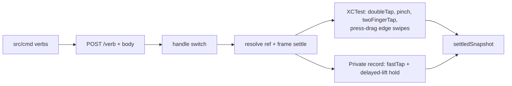

# iOS Interaction Verbs - Plan

## Goal Capsule

Add the missing app-agnostic interaction verbs to the iOS driver and CLI: `doubletap`, `pinch`, `hold`, `back`, `twofinger`, and `center`. Every verb works on any app through refs or coordinates, follows the existing tap/swipe wire patterns, and lands with CLI surface, skills guide, PRD rows, and tests. Stop when each verb performs on the live headed simulator, the Rust gates pass, and the driver target builds without the relocated probe. The probe file already moved to `docs/experiments/GestureProbe.swift`; this plan keeps it out of git.

## Product Contract

### Summary

The P1 CLI drives apps through snapshot, tap, type, swipe, and home. Agents also need double-tap, pinch zoom, press-and-hold, back/forward navigation, two-finger tap, and Notification Center access. A 16-run headed-simulator probe proved the recipe for each verb and mapped the exact boundaries.

### Problem Frame

Agents testing real apps hit actions the current verbs cannot express: zooming a map, long-pressing for context menus, going back, opening Notification Center. Without these verbs agents fall back to raw coordinates with no driver support, or cannot act at all.

### Requirements

Gesture verbs. Each one resolves a ref or coordinates, acts, and returns a settled snapshot, per the §5.1 contract.

- R1. `doubletap` taps twice on a ref or an `x y` point, mirroring `tap` arg shapes.
- R2. `pinch` zooms a required ref with a required `scale` and optional `velocity`; scales at or near 1 (`|scale - 1| < 0.01`), non-positive, or non-finite scales are `BAD_REQUEST` because XCTest throws at the boundary.
- R3. `hold` presses a ref or an `x y` point for a duration defaulting to 1.0 s and returns the settled snapshot, which carries any context menu the hold raised.
- R4. `back` performs the system edge swipe with no target and returns the settled snapshot; the caller judges navigation from the tree. `forward` is deferred: no OS-level forward gesture exists outside web history, which the probe could not fire, so a verb that works nowhere observable does not ship.
- R5. `twofinger` performs a two-finger tap on a ref and returns the settled snapshot.
- R6. `center` opens Notification Center (`notification`) from the SpringBoard session and returns the SpringBoard snapshot. The verb takes no other value today; a Control Center opener ships separately per the deferred list.

Wire, CLI, and docs parity.

- R7. Every new driver verb gains a same-named CLI command, a skills-guide entry, and a PRD row in the §5.1 and §5.2 tables. The two-way guide accuracy test covers the new entries.
- R8. `docs/PRD.md` gains the new verb rows, updated verb counts, and the new CLI mapping rows. No other PRD behavior changes.

Purity and honesty.

- R9. The driver target builds without experiment code: the probe lives at `docs/experiments/GestureProbe.swift`, untracked and unreferenced, and stays out of every commit. Known probe gaps ship as documented limits with honest snapshots, never silent success: Safari history back, web long-press menus, Control Center opening.

### Scope Boundaries

In scope: the six verbs above across driver, CLI, guide, PRD, and tests. Deferred to follow-up work: `forward` (no observable OS-level gesture), hardware buttons beyond home, Android parity for the new verbs, web long-press menu support, a proven Control Center opener, Safari history-back support.

### Sources

- Probe: `docs/experiments/GestureProbe.swift` (16 headed-sim runs; key timings and boundaries in the Appendix).
- Driver verb switch and synthesis: `drivers/ios/Driver/AgentMobileServer.swift` (`handle`, `fastTap`, `point`, `resolve`, `flick`).
- CLI shape to mirror: `src/cli.rs`, `src/cmd/tap.rs`, `src/cmd/swipe.rs`, `src/cmd/mod.rs`.
- Guide and its two-way test: `src/cmd/skills.rs`, `tests/cli_lifecycle.rs`, `tests/common`.
- PRD tables: `docs/PRD.md` §5.1, §5.2, and the verb-set inventory.

---

## Planning Contract

### Key Technical Decisions

- KTD1. Hold synthesizes through the private pointer-event record with a delayed lift, extending the existing `fastTap` machinery. (session-settled: user-directed — chosen over XCTest `element.press`: the probe measured 60–100 s stalls and one AX-server death.)
- KTD2. Settle and validation use frame geometry plus frame-stability polling, never `isHittable` on web content. (session-settled: user-directed — chosen over hit-test reads: they throw on occluded links, and the verbs must stay app-agnostic.)
- KTD3. One press-drag primitive serves `back` and `center`, parameterized by start edge, axis, and travel: horizontal edge-to-80-percent for back, vertical top-edge-down for center. (session-settled: user-directed — chosen over per-app affordance taps: no app branches in the driver.)
- KTD4. `hold` defaults duration to 1.0 s; `pinch` defaults velocity to sign-matched 1.0; both validate with `BAD_REQUEST` on bad input, following the `swipe` direction guard. Near-1 scales fall in the same band per R2.
- KTD5. Gaps ship visible per R9: the verbs perform and snapshot, and docs mark Safari-back, web-menus, and Control Center as limits. (session-settled: user-directed — chosen over papering gaps with app-specific hacks.)

### High-Level Technical Design

Two synthesis paths carry all gestures. Plain XCTest calls serve `doubletap`, `pinch`, and `twofinger` plus press-drag edge swipes for `back`, `forward`, and `center`; the private event record serves `tap` already and gains `hold`.

### Assumptions

- The simulator-headed verification in the Verification Contract reproduces probe conditions closely enough to confirm each verb once; repeat flake-hunting stays out.
- `control` may fail to open on-device; U2 returns whatever the swipe produced and docs carry the limit.

### Sequencing

U1 then U2 (shared settle conventions, riskiest first), U3 after the wire shapes freeze, U4 after names freeze, U5 last on the full tree.

### Wire Shapes

The exact bodies U1–U3 share, so neither side invents key names. All actions return a settled snapshot unless noted.

| Verb | Body | Validation |
|---|---|---|
| `doubletap` | `ref` xor `x` and `y` | target required; shapes mirror `tap` |
| `pinch` | `ref`, `scale`, `velocity?` | `ref` required; `scale` positive, finite, `\|scale - 1\| >= 0.01`, else `BAD_REQUEST`; `velocity` defaults to sign-matched 1.0 |
| `hold` | target (`ref` xor `x` and `y`) required, `duration?` | `duration` defaults to 1.0, must be positive, else `BAD_REQUEST` |
| `back` | none | none |
| `twofinger` | `ref` | `ref` required |
| `center` | `which` with the single value `notification` | any other value is `BAD_REQUEST` |

---

## Implementation Units

### U1. Driver hold core

Goal: private-path press-and-hold plus the `hold` verb case.

Requirements: R3.

Dependencies: none.

Files: `drivers/ios/Driver/AgentMobileServer.swift`, `docs/experiments/GestureProbe.swift` (reference only, untouched).

Approach: generalize the `fastTap` record builder with a lift-delay parameter per KTD1; add the `hold` case accepting `ref` or `x`/`y` plus optional `duration` defaulting to 1.0, resolving and settling per KTD2, returning the settled snapshot. Reject non-positive durations with `BAD_REQUEST`. If the record-builder runtime signatures miss, fail fast with `DRIVER_ERROR` naming the Xcode and simulator versions instead of falling through to a stall.

Patterns to follow: the `tap` case (ref-or-coordinates, resolve, settled snapshot) and the `swipe` direction guard for validation errors.

Test scenarios: live headed-sim checks, one per item: hold a SpringBoard icon for 1.5 s surfaces its context menu as Button refs in the next snapshot; hold with default duration completes near 1 s plus settle; hold with duration 0 or negative returns `BAD_REQUEST`; hold on a stale ref returns `STALE_REF`.

Verification: driver builds; live checks observed this session; no committed Swift test target exists, so scenarios run live, not as unit tests.

### U2. Driver simple gestures

Goal: `doubletap`, `pinch`, `twofinger`, `back`, and `center` cases on existing machinery.

Requirements: R1, R2, R4, R5, R6.

Dependencies: none (shares U1 conventions).

Files: `drivers/ios/Driver/AgentMobileServer.swift`.

Approach: add one switch case per verb per KTD3 and KTD4 with the Wire Shapes bodies. `doubletap` mirrors `tap` arg shapes with `doubleTap`; `pinch` enforces the R2 scale band; `twofinger` calls element `twoFingerTap` on the resolved ref; `back` runs the shared primitive horizontally from the left edge; `center` runs it vertically from the top edge in the SpringBoard session and snapshots SpringBoard. Edge geometry lives in app-frame coordinates via the existing coordinate helpers: back starts near x 3 percent and travels to 80 percent width at 40 percent height, forward mirrors it, center starts near y 2 percent at 15 percent width and travels down to 70 percent height; the sim stays portrait. Probe geometry reference: `topSwipe` and `edgeSwipe` in `docs/experiments/GestureProbe.swift`.

Patterns to follow: `flick` for press-drag shape, `home` for device-button plus bundle reset, `swipe` for direction validation.

Test scenarios: live headed-sim checks, one per item: double-tap a link and coordinates without error; pinch out moves pixels and pinch at scale 1 is `BAD_REQUEST`; two-finger tap a native row activates it; back returns from a Settings drill page; Notification Center swipe surfaces cover-sheet UI in the SpringBoard snapshot; `center` with another value is `BAD_REQUEST`.

Verification: driver builds; live checks observed this session.

### U3. CLI verbs and guide

Goal: same-named CLI commands plus an honest skills guide.

Requirements: R7.

Dependencies: U1, U2 (wire shapes frozen).

Files: `src/cli.rs`, `src/cmd/mod.rs`, new `src/cmd/doubletap.rs`, `src/cmd/pinch.rs`, `src/cmd/hold.rs`, `src/cmd/back.rs`, `src/cmd/forward.rs`, `src/cmd/twofinger.rs`, `src/cmd/center.rs`, `src/cmd/skills.rs`, `tests/cli_gestures.rs`.

Approach: mirror the `tap`/`swipe` clap shapes per KTD4 with the Wire Shapes bodies (`doubletap` takes ref-or-`x y`; `pinch` takes a required ref, required scale, and optional velocity; `hold` takes a required ref-or-coordinates target plus optional duration; `back` takes nothing; `twofinger` takes a ref; `center` takes `notification`). Each module posts its verb body through `round_trip`. Extend the guide text and its two-way coverage to the new commands.

Patterns to follow: `src/cmd/swipe.rs` for direction validation and optional refs; `tests/cli_lifecycle.rs` stub style for request-shape asserts.

Test scenarios: stub-driver tests in `tests/cli_gestures.rs`, one per item: each command posts the right path and body fields; scale-equivalent misuse exits 2 client-side where clap owns validation; near-1 and non-finite scales are covered; the guide names every new command and every command names back (two-way accuracy); `--help` lists the new commands.

Verification: `cargo test --workspace --locked` plus the repo gates in the Verification Contract.

### U4. PRD patch

Goal: the PRD inventories the new surface exactly.

Requirements: R8.

Dependencies: U3 (names frozen).

Files: `docs/PRD.md`.

Approach: add §5.1 rows for the seven verbs with params, returns, and limits; add §5.2 rows for the CLI mapping; update the verb-set inventory and any counts that enumerate verbs.

Test expectation: none -- prose inventory with no behavior.

Verification: reviewer diff of the PRD hunks against the shipped `--help` and driver switch.

### U5. Purity and acceptance

Goal: prove the tree is clean and the verbs work end to end.

Requirements: R9.

Dependencies: U1–U4.

Files: none (verification only).

Approach: build the driver target to prove folder-sync no longer compiles the probe; run the full Rust gates; dogfood each new verb once on the headed simulator; confirm `git status` shows no experiment file under `drivers/` and the probe stays untracked.

Test scenarios: `xcodebuild build` succeeds with the probe outside `drivers/`; `cargo test --workspace --locked` passes; each new CLI verb performs once live and returns a settled snapshot.

Verification: gate outputs observed this session.

---

## Verification Contract

- `cargo fmt --all -- --check` and `cargo clippy --all-targets --locked -- -D warnings` with the repo pedantic rules (doc comments only, complexity caps, file length caps per `CONTRIBUTING.md`).
- `cargo test --workspace --locked` including the new `tests/cli_gestures.rs`.
- `cargo deny check`.
- `xcodebuild build` of the driver scheme proves `docs/experiments/GestureProbe.swift` is outside the folder-synced target.
- Headed-simulator dogfood of each new verb per U1, U2, and U5 scenarios. Each live check runs twice and counts on two successes; an infrastructure flake (synthesis stall, runner death) retries once after a clean simulator boot.
- Commit hygiene: stage exact paths, never `git add -A`; the probe stays untracked and out of every commit.

## Definition of Done

- All six verbs perform on the live simulator and return settled snapshots.
- CLI, guide, PRD, and tests name the same surface with no drift.
- All repo gates pass and the driver builds without experiment code.
- Abandoned probe scaffolding is out of the diff: no experiment file under `drivers/`, no scratch logs committed.

## Appendix

Implementation notes recorded during U5. `forward` was dropped from the release (R4): live verification showed no OS-level forward gesture outside web history, which the probe could not fire. A pre-existing `Driver.hash` trap on non-finite frames (SIGTRAP on Notification Center trees) was fixed with a clamping quantizer; `center` is its regression proof.

Probe evidence carried forward because `/tmp` logs are scratch. Double-tap element and coordinate green across five runs at roughly 1–3 s. Pinch out/in round-trip on Maps with pixel-diff near 0.99 both directions; scale 1.0 throws inside XCTest. Coordinate and element `press` stall 60–100 s on web and SpringBoard targets with one AX-server death; the private delayed-lift press opened the icon menu in 4.4 s. Menu items surface as Buttons (`com.apple.springboardhome.application-shortcut-item.rearrange-icons`, `...remove-app`). Native edge-back green 3/3; Safari history-back never fired across five variants. Native two-finger tap opened its target in 1.4 s; occluded web frames fail inside XCTest. Notification Center opens 6/6 from Home top-edge swipes; Control Center variants landed on the cover sheet. Runner deaths (3) correlate with backgrounded 45 s sleeps: keep driver timeouts short.
