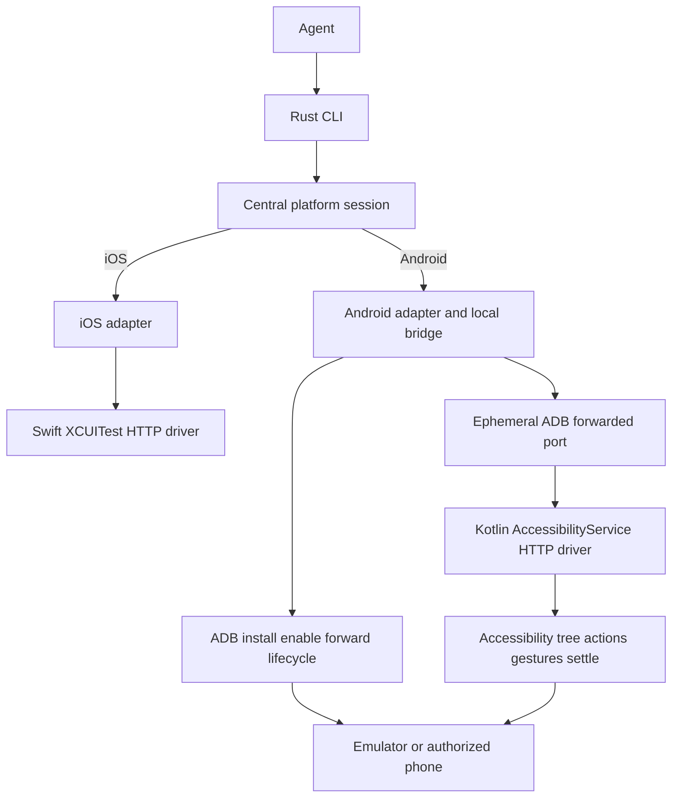
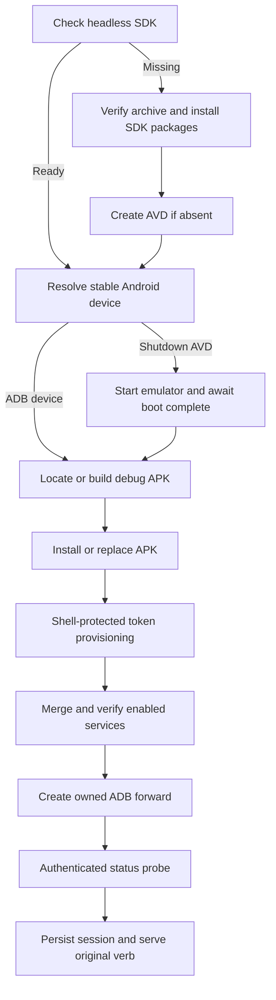

# P2 Android Device Driver - Plan

## Goal Capsule

- **Objective:** Build P2 from `docs/PRD.md` §6.2: install a complete headless Android development toolchain on the current Mac without Android Studio, add the Kotlin `AccessibilityService` driver and Rust/ADB host adapter, support emulator and physical-device sessions through the existing CLI contract, and record Experiment 10 creating an alarm in Clock.
- **Authority:** `docs/PRD.md` §§3–7 governs product behavior and scope. The shipped P1 implementation is authoritative for the existing protocol, session, error, and command conventions. Android platform documentation and the repo's Android research constrain mechanisms where the PRD leaves details open.
- **Stop conditions:** The headless SDK check passes with Android Studio absent; the Android unit, Rust, lint, dependency, and emulator gates pass; the same CLI snapshot/act contract drives the emulator; Experiment 10 is recorded verbatim for the emulator and for a physical phone when one is available, otherwise the phone leg is explicitly marked not run with its exact manual procedure; no token, signing secret, or private device data appears in logs, diffs, or scripts.
- **Execution profile:** Deep, cross-platform work spanning machine bootstrap, a new Gradle/Kotlin app, a Rust host-adapter crate, the CLI's platform seam, process/session lifecycle, emulator CI, docs, and live device proof.
- **Tail ownership:** `ce-work` or an equivalent executor owns the dependency order below, including running the repository bootstrap against the current Mac. Production APK signing and release distribution remain outside P2.

## Execution Progress

- [x] U1. Headless Android toolchain and Gradle scaffold (`08dc7e3`)
- [x] U2. Authenticated Android service and protocol endpoint (`22fafd6`)
- [x] U3. Android tree, refs, and settle engine (`348f3b9`)
- [x] U4. Android actions, gestures, screenshots, and system verbs (`9b91abb`)
- [x] U5. Rust ADB adapter and lifecycle bridge (`334105c`)
- [x] U6. Cross-platform discovery and session integration (`abf3877`)
- [x] U7. Cross-platform contract fixtures and operator documentation
- [ ] U8. Android emulator CI and live integration gate
- [ ] U9. Experiment 10 and P2 completion

---

## Product Contract

### Summary

P2 adds Android as a first-class target behind the same agent-facing protocol already shipped for iOS. A Kotlin companion APK hosts an `AccessibilityService`, reads the active accessibility tree, re-resolves snapshot-qualified refs, performs actions, settles, and serves authenticated HTTP on device loopback. A Rust adapter uses ADB to discover and boot devices, build and install the APK, provision the session without exposing its token, enable the service, forward the port, and bridge the lifecycle operations Android does not grant to an ordinary accessibility app.

The current Apple Silicon Mac is also prepared for this work using standalone Android command-line tools only. Android Studio must not be installed or required.

### Problem Frame

P1's CLI and core are structurally iOS-specific at the three platform-aware seams named by the PRD: device discovery, `serve`, and lazy start. The verb modules and wire contract are already platform-neutral, but Android has no implementation behind them. The current Mac has JDK 17 and Gradle, while `adb`, `sdkmanager`, `avdmanager`, the emulator, and the configured SDK directory are absent. A repeatable headless bootstrap is therefore part of the deliverable, not an undocumented prerequisite.

Android's public `AccessibilityService` supplies the required cross-app tree, node actions, gestures, global actions, and screenshots once the developer explicitly enables it. It cannot force-stop arbitrary apps on Android 14 or later, so protocol-compatible cold launch and terminate semantics need a narrow ADB-backed host bridge rather than a dishonest in-app approximation. Physical-device use remains consented and developer-controlled through authorized USB or wireless ADB; the plan does not bypass Restricted Settings, Advanced Protection, or other user security controls.

### Actors

- A1. AI coding agent. Reads compact snapshots and issues the existing CLI verbs without needing to know whether the selected device is iOS or Android.
- A2. Developer. Runs the headless SDK bootstrap, chooses an emulator or an ADB-authorized phone, completes any Android security confirmation the OS requires, and hands the agent the CLI.
- A3. CI runner. Builds both languages, boots one disposable Android emulator, provisions the driver, runs the live contract smoke, and tears down only resources it owns.

### Requirements

**Headless development environment**

- R1. Android development on the current Mac uses the standalone Android command-line tools and a Gradle wrapper. Android Studio is neither installed nor required.
- R2. The repository carries an idempotent bootstrap/check script that installs or verifies command-line tools build `15859902`, SDK Platform 37, Build Tools 36.0.0, platform-tools, the emulator, and an API 37 Google APIs system image appropriate to the host architecture.
- R3. The bootstrap uses JDK 17, creates a named `agent-mobile-api37` AVD when absent, preserves unrelated SDK packages and AVDs, and makes `sdkmanager`, `avdmanager`, `adb`, and `emulator` available through the documented shell environment.

**Android driver and protocol**

- R4. A Kotlin APK under `drivers/android/` targets and compiles against API 37 with `minSdk` 30, the first API that supports the required accessibility screenshot verb. It declares a non-assistive `AccessibilityService` with window-content retrieval, view IDs, interactive windows, non-important views, gestures, and screenshots. It does not claim `isAccessibilityTool`, request Play distribution, or add instrumentation/Shizuku.
- R5. The Android endpoint enforces protocol version `"1"`, bearer authentication, `POST /<verb>`, bounded request sizes and socket timeouts, the existing success/error envelope, and the six-code error registry. It listens on device loopback and is reached through ADB forwarding.
- R6. Android snapshots emit the existing node schema and compact text shape. `native_id.kind` adds `resource_id`; `test_tag` and `test_id` remain valid contract kinds but Compose `refreshWithExtraData` support stays deferred per the PRD. Nodes marked as passwords never emit their live value into JSON or text.
- R7. Every Android node receives a per-snapshot `@<snapshot_id>:e<N>` ref. Each new snapshot invalidates prior refs. Ref actions walk a fresh tree and match class/role, resource ID, label, and bounds within the documented tolerance; zero matches return `STALE_REF`, multiple matches return `AMBIGUOUS_TARGET`, and the driver never guesses.
- R8. Android settle behavior mirrors P1: hash role/type, integer bounds, label, native ID, and value; require two consecutive matching reads at least 150 ms apart; stop after 3 seconds; report `settled`, `reads`, and `settle_ms`; return the last usable tree when the cap expires.
- R9. Android implements `status`, `snapshot`, `tap`, `doubletap`, `pinch`, `hold`, `back`, `twofinger`, `center notification`, `type`, `swipe`, `home`, `screenshot`, and the lifecycle results exposed through the host bridge. Successful actions return the next settled snapshot.
- R10. Node actions prefer semantic `AccessibilityNodeInfo.performAction` where it preserves the requested behavior and use `dispatchGesture` for coordinate and multi-pointer input. System navigation uses `performGlobalAction`. Text uses `ACTION_SET_TEXT` against the addressed or focused editable node for P2.

**Host adapter and shared CLI**

- R11. A Rust crate at `crates/android/` discovers running ADB devices and configured AVDs, distinguishes emulator and physical targets, boots a selected AVD, builds or locates the APK, installs it, provisions a fresh token, enables the service without deleting other enabled accessibility services, creates the port forward, and verifies an authenticated `status`. A debug-signature mismatch fails without uninstalling and prints the exact explicit reinstall remedy.
- R12. Token provisioning uses an exported `ContentProvider` protected by a platform signature permission and an in-process root/shell UID check. The token is generated on device and returned only through the provider call result; it never appears in a host process argument, Android log, driver log, state JSON, or committed file.
- R13. The host adapter implements cold `launch` and real `terminate` through authorized ADB while preserving the public protocol envelope. Android's app UID must not fake termination with Home or rely on an API that cannot stop third-party apps on current Android.
- R14. Platform selection is centralized. `devices`, `serve`, and lazy start call one platform layer that normalizes iOS and Android devices, resolves an exact ID before a unique display name, and returns the launch/session information `serve` needs. Individual verb modules remain platform-neutral.
- R15. Existing P1 sessions remain readable. New state records carry enough optional platform and stable-device identity to reconnect, clean up owned forwards/processes, and avoid name collisions without placing tokens in JSON.
- R16. `agent-mobile devices` shows `platform`, stable ID, kind, OS, state, and live-session URL. A missing Android toolchain is a non-fatal note when iOS remains usable; a missing iOS toolchain is a non-fatal note when Android remains usable.
- R17. Android lazy start uses the remembered target or a configured AVD, delegates to the same foreground `serve` lifecycle as iOS, reports bounded boot progress, and leaves no stale state or ADB forward when `serve` exits.

**Proof, documentation, and boundaries**

- R18. The repository adds pure Kotlin tests for protocol/tree/ref/settle logic, Rust tests for ADB parsing/platform selection/proxy envelopes/state compatibility, and one ignored live Android integration test that boots through the public CLI and reads a real snapshot.
- R19. CI adds the PRD's `android-emulator` job on Ubuntu with pinned actions, bounded boot and test timeouts, Gradle wrapper checksum verification, SDK package installation, a disposable AVD, and the live integration test.
- R20. `README.md`, `agent-mobile skills`, and setup diagnostics document the no-Studio install, emulator flow, physical USB and wireless-ADB flow, manual Restricted Settings fallback, sideload-only policy, and executable recovery steps.
- R21. Experiment 10 records verbatim CLI output for creating an alarm in the Clock app on the emulator, with token-shaped values redacted before the transcript is saved. When an ADB-authorized physical phone is available, the same flow is recorded there; when none is available, the results state that the phone leg was not run and preserve an exact manual verification procedure without claiming success.

### Key Flows

- F1. Headless Mac bootstrap
  - **Trigger:** A2 starts from the current Mac where Android SDK tools are missing.
  - **Actors:** A2.
  - **Steps:** Run the repository bootstrap; verify the official archive checksum; install SDK packages under the configured SDK root; accept licenses; create the named AVD if absent; run check mode.
  - **Outcome:** All required CLI tools and the API 37 AVD exist, while `/Applications/Android Studio.app` remains absent.
  - **Covered by:** R1–R3.
- F2. Android emulator lazy start
  - **Trigger:** A1 invokes a verb with the Android AVD selected and no live session.
  - **Actors:** A1, A2.
  - **Steps:** Lazy start takes the boot lock; the adapter starts and waits for the AVD; Gradle builds the driver if needed; ADB installs, provisions, enables, and forwards it; authenticated status passes; the original verb runs.
  - **Outcome:** The first verb returns through the normal CLI contract and state points at the owned session.
  - **Covered by:** R11–R17.
- F3. Physical Android session
  - **Trigger:** A2 selects a USB-authorized or wireless-ADB-connected phone.
  - **Actors:** A2, A1.
  - **Steps:** The adapter installs and provisions the APK; attempts consented ADB enablement while preserving other services; if Android blocks it, prints the exact App Info and Accessibility steps; forwards loopback and verifies status.
  - **Outcome:** The same CLI verbs drive the phone without Android Studio or a cable after wireless ADB is connected.
  - **Covered by:** R4, R11, R12, R16, R20.
- F4. Snapshot and act
  - **Trigger:** A1 requests a snapshot and then acts on a returned ref.
  - **Actors:** A1.
  - **Steps:** The service reads and serializes a fresh tree; mints refs; resolves the chosen ref against a new tree; performs a semantic action or gesture; waits for bounded settle; returns the replacement tree.
  - **Outcome:** The agent receives a fresh ref set or a fail-loud stale/ambiguous error, never a guessed target.
  - **Covered by:** R5–R10.
- F5. Android lifecycle verb
  - **Trigger:** A1 invokes `launch` or `stop` against Android.
  - **Actors:** A1.
  - **Steps:** The local Android session bridge validates the normal request, executes the authorized ADB lifecycle operation, asks the on-device service for the resulting observation when applicable, and returns the normal protocol envelope.
  - **Outcome:** Launch is a cold start and stop really terminates the target while the driver remains reachable.
  - **Covered by:** R9, R13, R14.
- F6. Session teardown
  - **Trigger:** A2 interrupts foreground `serve`, lazy-started `serve` exits, or CI finishes.
  - **Actors:** A2, A3.
  - **Steps:** The owner closes the local bridge, removes only its ADB forward, clears state and token files, and reaps only child processes it started. It leaves the user's emulator/device and enabled accessibility preference intact.
  - **Outcome:** No stale listener, token, state row, or forward remains, and unrelated device configuration is preserved.
  - **Covered by:** R12, R15, R17, R19.

### Acceptance Examples

- AE1. Given the current Apple Silicon Mac with no Android SDK directory, when the bootstrap runs, then `sdkmanager`, `avdmanager`, `adb`, and `emulator` pass check mode, `agent-mobile-api37` exists, and Android Studio has not been installed.
- AE2. Given no running Android emulator and no agent-mobile session, when `agent-mobile --device agent-mobile-api37 snapshot` runs, then the AVD boots, the driver is built/installed/provisioned, and the command returns a protocol-v1 settled snapshot.
- AE3. Given an ADB-authorized physical phone whose OS requires manual Restricted Settings confirmation, when automatic enablement is denied, then `serve` stops before exposing a session and prints the exact human steps; retrying after consent succeeds without disabling another accessibility service.
- AE4. Given a ref minted by snapshot A, when snapshot B supersedes it or the live node identity changes, then an action with the old ref returns `STALE_REF` and does not inject input.
- AE5. Given two live nodes that match one recorded identity, when the agent acts on that ref, then the driver returns `AMBIGUOUS_TARGET` and does not choose either node.
- AE6. Given a density-scaled, inset app window, when the agent coordinate-taps a point copied from the returned logical bounds, then the injected physical pixel lands at the same node center.
- AE7. Given a target app running on Android 17, when the agent calls `stop`, then the ADB bridge force-stops that package, returns its package name in the terminate payload, and a later `status` still reaches the accessibility driver.
- AE8. Given Clock on the emulator, when the Experiment 10 transcript follows only public CLI commands, then an alarm is created and visible in the final settled snapshot.
- AE9. Given an ADB-authorized phone is available, the same Experiment 10 flow proves the physical-device leg. Given no phone is available, completion records the leg as not run and leaves the literal command checklist for a developer to execute later.

### Scope Boundaries

**Included in P2**

- Headless Android SDK, emulator, and AVD setup on the current Mac.
- Kotlin accessibility driver, Rust ADB adapter, shared platform seam, emulator CI, docs, and Experiment 10.
- Source-checkout debug APK builds and local sideloading for development and proof.
- Authorized ADB over USB, emulator transport, or Android wireless debugging.

**Deferred to follow-up work**

- Compose `testTag` extraction through `refreshWithExtraData`.
- Instrumentation, Shizuku, shell-UID brokers, permission grants, rotation controls, and app-data clearing.
- Production APK signing, Android Developer Verification enrollment, GitHub/F-Droid artifacts, and npm bundling of a signed Android APK.
- P3's third-read/minimum-window settle hardening, system-alert surface, `scroll_until_visible`, and benchmark.
- Multiple simultaneously served devices; P2 preserves the existing one-foreground-serve lifecycle.

**Outside this product's identity**

- Android Studio installation or IDE-dependent build steps.
- Public Google Play listing or a false `isAccessibilityTool` declaration.
- Restricted Settings, Enhanced/Advanced Protection, user-consent, or OEM security bypasses.
- Hidden retry, fuzzy target matching, self-healing locators, root, or malware-style persistence.
- Canvas/game/opaque-surface vision support.

### Success Criteria

- The current Mac passes the repository's Android SDK check with no Android Studio installation.
- The Android driver serves protocol v1 and the Rust CLI uses the same verb/output/error contract on iOS and Android.
- Android emulator CI passes from a clean runner with no GUI IDE.
- Experiment 10 creates an alarm through the CLI on the configured emulator and on an ADB-authorized physical phone when one is available; an unavailable phone is reported honestly with a runnable manual checklist.
- No token, signing secret, or unredacted sensitive value appears in logs, diffs, transcripts, state JSON, or committed scripts.
- Existing iOS unit and simulator behavior remains green.

### Dependencies

- JDK 17. The current Mac already has a JDK 17 runtime; project builds use the Gradle wrapper and do not depend on the globally installed Gradle 8.14.3.
- Official Android command-line tools build `15859902`, Android Platform 37, Build Tools 36.0.0, platform-tools, emulator, and architecture-specific API 37 Google APIs system images.
- Android Gradle Plugin 9.3.0 and Gradle 9.5.0, both older than seven days and compatible with API 37 and JDK 17. AGP's built-in Kotlin support avoids a separate Kotlin plugin pin.
- A physical-phone proof requires developer-authorized ADB, an available phone, and the user's explicit accessibility-service enablement. It never runs in CI, and device unavailability does not authorize a fabricated result.

### Sources

- Product authority: `docs/PRD.md` §§3–7, 11.
- Existing contract and lifecycle: `crates/core/src/contract.rs`, `crates/core/src/wire.rs`, `crates/core/src/state.rs`, `crates/core/src/ios/`, `src/cmd/devices.rs`, `src/cmd/serve.rs`, `src/cmd/lazy.rs`, `drivers/ios/Driver/`.
- Android research: `docs/research/05-android-accessibility-service.md`, `docs/research/06-android-uiautomator-shizuku.md`, `docs/research/08-ui-framework-semantics.md`, `docs/research/09-prior-art-architectures.md`, `docs/research/10-distribution-and-security.md`, `docs/research/11-reliability-and-idle-sync.md`.
- Official Android command-line tools, SDK manager, ADB, AccessibilityService, Android 17 SDK, local-network permission, AGP 9.3, and built-in Kotlin documentation from `developer.android.com`.

---

## Planning Contract

### Key Technical Decisions

- KTD1. **Use a pinned, repository-owned headless SDK bootstrap.** The requested no-Android-Studio constraint is feasible because Google publishes Apple Silicon command-line tools, `sdkmanager`, `avdmanager`, emulator, and ADB separately. `scripts/setup-android-sdk.sh` owns install and check modes, verifies Google's archive against the pinned SHA-256, installs into `${ANDROID_HOME:-$HOME/Library/Android/sdk}`, and never deletes unrelated packages or AVDs. It records command-line tools build `15859902`; project-level versions remain in Gradle files and the wrapper. Governs R1–R3.
- KTD2. **Pin AGP 9.3.0 with Gradle 9.5.0 and built-in Kotlin.** AGP 9.3 supports API 37, requires Gradle 9.5.0 and JDK 17, defaults to Build Tools 36.0.0, and predates this run by more than seven days. The app sets `compileSdk=37`, `targetSdk=37`, and `minSdk=30`; API 30 is the support floor because P2 requires `AccessibilityService.takeScreenshot` rather than a partial verb set on older Android. AGP 9.x's built-in Kotlin support removes the separate `org.jetbrains.kotlin.android` plugin and its version-skew surface. The app otherwise uses Android SDK and Java/Kotlin standard-library APIs; JUnit 4.13.2 is the only test dependency. Governs R2, R4, R18.
- KTD3. **P2 builds a source-checkout debug APK; production signing stays deferred.** Gradle's generated debug key is sufficient for the emulator and developer-owned sideload proof, while committing a signing key or pretending an unsigned release APK is distributable would violate the repo's security posture. The host adapter invokes the wrapper when the configured/debug APK is missing and supports `AGENT_MOBILE_ANDROID_APK` for an explicitly supplied signed artifact. If an installed build has a different signature, installation fails with the explicit uninstall/reinstall command and does not silently delete the driver app or its settings. Governs R11, R20.
- KTD4. **Host the protocol inside one AccessibilityService process.** The service starts a small standard-library `ServerSocket` endpoint when connected, binds `127.0.0.1:8770`, and stops it on service destruction. No Ktor, coroutine runtime, foreground service, background daemon, LAN listener, or Play-facing UI is added. ADB forwarding supplies host reachability for emulator, USB, and wireless-ADB phones. Governs R4, R5.
- KTD5. **Provision secrets through a shell-UID-checked content provider.** An exported `ContentProvider` protected by `android.permission.DUMP` handles only its named provisioning method, checks `Binder.getCallingUid()` against root and shell, generates a fresh cryptographic token on device, persists it in app-private preferences, restarts the HTTP listener when needed, and returns the token in the provider result bundle. The signature permission blocks ordinary apps and the UID check narrows privileged callers to the authorized ADB path; the host never passes the token in argv. Driver and host error paths redact provider output. Governs R5, R12.
- KTD6. **Mirror P1's ref and settle rules over Android-native identity evidence.** A snapshot stores only immutable identity records, not recyclable live `AccessibilityNodeInfo` handles. Identity uses class/role, `viewIdResourceName`, text/content description, and raw screen bounds. An action re-walks a fresh root and requires exactly one match. Nodes whose `isPassword` flag is set retain role, state, bounds, and actions but serialize an empty value in JSON and text. Settle polls fresh trees at the same 150 ms and 3 s bounds as iOS. Iterative traversal tracks visited node identity and applies a defensive node/depth cap; if the platform yields a cycle or exceeds the cap, the response marks `complete:false` rather than recursing forever. Governs R6–R8.
- KTD7. **Expose logical app-frame coordinates while matching raw pixels.** Android accessibility bounds and gesture injection are physical pixels, while the shared contract describes app-frame points. The driver subtracts the active root's screen origin and divides by display density when serializing bounds. Coordinate input reverses that transform before `dispatchGesture`. Ref identity and tolerance remain in raw pixels so conversion does not create ambiguous matches. Governs R6, R7, R9 and AE6.
- KTD8. **Prefer semantics, then fall back to gestures explicitly.** `tap` and editable `type` first use advertised node actions; ref and coordinate gestures use the matched/root frame and bounded `GestureResultCallback`. Multi-pointer verbs build simultaneous strokes; `back`, `home`, and notifications use global actions. Unsupported or rejected platform operations become `DRIVER_ERROR`, not silent success. P2 text deliberately uses `ACTION_SET_TEXT`; an accessibility IME is a separate product decision. Governs R9, R10.
- KTD9. **Bridge Android lifecycle verbs at the one platform endpoint.** Current Android forbids third-party apps from force-stopping other packages, so the on-device app cannot honestly implement P1's cold `launch` and `terminate`. Android `serve` exposes a local protocol bridge in `crates/android`: ordinary verbs forward to the loopback-forwarded service; `launch` and `terminate` execute scoped `adb shell am` operations against the selected serial, then compose the existing protocol-v1 result from a fresh driver observation. CLI verb modules still build JSON and call one session endpoint, so platform branching remains centralized and the public contract stays truthful. Governs R9, R13, R14.
- KTD10. **Normalize platform identity in `src/platform.rs`.** A `PlatformDevice` carries platform, stable ID, display name, kind, OS, and state. Discovery probes iOS and Android independently and combines successes plus non-fatal notes. Selection matches stable ID first and a display name only when unique. Adapter-specific build/boot/session details stay behind the enum; command files do not import `ios` or `android`. Governs R14, R16.
- KTD11. **Extend state compatibly instead of invalidating P1.** Optional `platform`, `device_id`, and adapter cleanup metadata join `SessionEntry` with serde defaults. Existing version-1 rows infer iOS and retain their current key behavior. New rows use a collision-free platform/stable-ID key while display names remain output only. Tokens stay in `0600` files, and only owned PID/forward metadata is eligible for teardown. Governs R12, R15, R17.
- KTD12. **Preserve user accessibility settings during enablement.** The adapter reads the colon-separated enabled-service set, adds only the agent-mobile component, writes it back, enables accessibility globally when needed, and verifies the component appears. It never clears TalkBack or another service. If the OS rejects the change or the service does not bind, the CLI opens/names the standard Accessibility settings and reports the Restricted Settings/App Info confirmation path; it never attempts a bypass. Governs R11, R17, R20.
- KTD13. **Treat configured AVDs as discoverable devices.** Android discovery combines `adb devices -l` with `emulator -list-avds`; running emulator serials are correlated with their AVD names, and absent configured AVDs appear as shutdown emulators. Boot uses the `emulator` binary with headless flags, waits for ADB authorization and `sys.boot_completed`, and times out with the log path. Physical entries expose the ADB serial as stable ID. Governs R3, R11, R16, R17.
- KTD14. **Leave the device enabled but remove host-owned session resources.** Ctrl-C and failure close the local bridge, remove only the selected serial's owned forward, remove state/token files, and reap only processes started by this session. They do not disable the AccessibilityService, stop another accessibility tool, wipe an AVD, or kill the user's emulator. This matches P1's leave-the-simulator-running behavior and avoids destructive cleanup. Governs R15, R17.
- KTD15. **Split fast deterministic tests from one live emulator gate.** Pure tree/ref/settle/protocol rules receive JVM tests over platform-neutral snapshots. Rust fixtures cover ADB parsing, selection ambiguity, state migration, secret redaction, and lifecycle envelope composition. The ignored integration test alone boots an emulator and proves build/install/provision/enable/forward/status/snapshot through the public CLI. CI invokes it explicitly after the deterministic suites. Governs R18, R19.

### High-Level Technical Design

The CLI continues to see one authenticated protocol endpoint per selected device. iOS keeps its direct driver endpoint. Android `serve` owns a localhost bridge because ordinary accessibility-app privileges cannot provide truthful cold-launch and terminate semantics; every other request passes through unchanged to the loopback-forwarded service.



Android setup and first use form one bounded progression with distinct failure remedies.



### Assumptions

- The current machine remains Apple Silicon macOS and continues to have a usable JDK 17. The setup script verifies rather than replaces Java.
- API 37 and its Google APIs emulator images remain available through `sdkmanager`. A package-index surprise blocks the unit for explicit plan revision rather than silently changing API level.
- A physical proof device may not be connected during implementation. When one is available it must permit developer-authorized ADB and user-enabled accessibility. Android Advanced Protection or organizational device policy may make the rail unavailable; either condition is reported rather than worked around or represented as a successful proof.
- Clock's package/activity differs across emulator images and OEM phones. Experiment setup resolves the installed Clock package through ADB rather than hard-coding one vendor ID.

### Sequencing

1. Establish the reproducible toolchain and Gradle scaffold before code depends on them.
2. Build and test the on-device protocol/tree/action engine independently over a local forwarded port.
3. Build the Rust ADB adapter and Android lifecycle bridge against recorded ADB/protocol fixtures.
4. Replace direct iOS imports in CLI seams with the centralized platform layer while keeping P1 green.
5. Add the live emulator gate, then complete the physical-phone transcript and docs.

### Research That Shaped the Plan

- Local inspection found JDK 17 and a stale `ANDROID_SDK_ROOT` shell export, but no SDK directory, ADB, SDK manager, AVD manager, or emulator. That made system bootstrap an explicit P2 unit.
- Google's current docs confirm standalone Apple Silicon command-line tools and a no-Studio SDK/AVD workflow. AGP 9.3's published compatibility table fixes Gradle 9.5.0, JDK 17, Build Tools 36.0.0, and API 37 compatibility; AGP 9's built-in Kotlin support removes a separate plugin.
- Android's API reference confirms that Android 14+ third-party apps can kill only their own processes. This invalidates an on-device fake for `terminate` and makes the narrow host lifecycle bridge load-bearing.
- The repo's research fixes the AccessibilityService flags, Restricted Settings consent boundary, sideload-only policy, per-snapshot ref model, two-read bounded settle, and Compose `testTag` deferral.
- Android 17's local-network permission reinforces loopback plus ADB forwarding over a LAN-bound service. It avoids a new runtime permission and keeps the driver local by default.

### System-Wide Impact

- **Contract:** Protocol version remains `"1"` because the added `native_id` values are already named by the PRD and existing serde uses a string kind. Existing iOS fixtures continue to parse unchanged.
- **State:** Optional platform metadata extends the file without exposing tokens or invalidating P1 rows.
- **Process ownership:** `serve` gains a second lifecycle shape without broadening which external processes it may terminate.
- **Security:** An exported provisioning surface is introduced but constrained to the Android shell signature permission, explicit component addressing, one returned secret, app-private storage, loopback networking, and log redaction.
- **Developer environment:** The repository gains an idempotent SDK bootstrap that changes files under the selected SDK root and creates one named AVD; it does not install an IDE or alter unrelated SDK/AVD entries.
- **CI:** The new emulator job adds substantial runtime and cache pressure, so boot, build, and integration phases each need explicit time bounds and failure logs.

### Risks and Mitigations

| Risk | Mitigation |
|---|---|
| Restricted Settings or device policy prevents service enablement | Verify after the merge-write; stop with exact manual consent instructions; never bypass or claim success early |
| Accessibility trees contain cycles, dead nodes, or change during traversal | Iterative fresh reads, visited-node tracking, defensive caps, structured `DRIVER_ERROR`/`complete:false`, no retained live node handles |
| ADB output varies by version, OEM, authorization state, or locale | Parse stable machine-oriented fields, query properties separately, fixture common variants, and preserve raw redacted diagnostics |
| Lifecycle proxy drifts from protocol envelope behavior | Reuse core envelope types and wire client, run shared contract fixtures through both direct and bridged endpoints |
| Token leaks through provisioning subprocess output | Generate on device, return as result data, parse through a redacting path, never include in argv/state/log/debug output |
| Emulator CI is slow or flaky | Architecture-specific image, KVM check, headless deterministic flags, boot-complete polling, one live test, bounded log capture |
| API 37 or AGP behavior changes under latest package resolution | Pin AGP/wrapper/archive and package IDs; commit wrapper checksum; block rather than silently upgrading |
| Debug APK is mistaken for a production artifact | Label source-checkout/debug scope in diagnostics and docs; no release task, signing key, or published APK in P2 |
| An existing driver APK was signed by another debug or release key | Fail install without uninstalling; print the explicit uninstall/reinstall remedy and require the developer to choose the data-destructive step |
| Android Studio is installed indirectly by a convenience tool | Bootstrap downloads only the command-line archive and SDK packages; check mode explicitly reports Studio presence |

---

## Output Structure

```text
crates/android/
├── Cargo.toml
├── src/
│   ├── adb.rs
│   ├── device.rs
│   ├── driver.rs
│   ├── lib.rs
│   └── proxy.rs
└── tests/
drivers/android/
├── build.gradle.kts
├── settings.gradle.kts
├── gradle.properties
├── gradle/wrapper/
├── gradlew
├── gradlew.bat
└── app/
    ├── build.gradle.kts
    └── src/
        ├── main/
        │   ├── AndroidManifest.xml
        │   ├── java/com/lahfir/agentmobile/driver/
        │   └── res/xml/accessibility_service.xml
        └── test/
scripts/
├── setup-android-sdk.sh
└── ci-boot-android-emulator.sh
src/platform.rs
tests/integration_android.rs
```

The exact Kotlin file split may change to stay readable, but protocol, tree/ref, gesture, service, provisioning, and HTTP responsibilities remain separate.

---

## Implementation Units

### U1. Headless Android toolchain and Gradle scaffold

- **Goal:** The current Mac and a clean CI shell can build an Android APK without Android Studio.
- **Requirements:** R1–R3.
- **Dependencies:** none.
- **Files:** `scripts/setup-android-sdk.sh`, `drivers/android/settings.gradle.kts`, `drivers/android/build.gradle.kts`, `drivers/android/gradle.properties`, `drivers/android/gradle/wrapper/gradle-wrapper.properties`, `drivers/android/gradle/wrapper/gradle-wrapper.jar`, `drivers/android/gradlew`, `drivers/android/gradlew.bat`, `drivers/android/app/build.gradle.kts`, `drivers/android/app/src/main/AndroidManifest.xml`, `.gitignore`.
- **Approach:**
  1. Add install/check modes with pinned official archive URLs and checksums for Darwin arm64/x86_64 and Linux x86_64.
  2. Install only the package IDs in R2, accept licenses non-interactively for the requested setup, and create `agent-mobile-api37` only when absent.
  3. Make shell exports explicit and idempotent without deleting or rewriting unrelated user shell configuration; prefer a small sourced environment block over repeated ad hoc paths.
  4. Generate the Gradle 9.5 wrapper with `distributionSha256Sum`, pin AGP 9.3.0, use built-in Kotlin and Java 17, and add the minimal app namespace plus buildable placeholder manifest that U2 expands.
  5. Run the script against this Mac and verify all tool paths, package versions, AVD visibility, emulator acceleration, and Android Studio absence.
- **Execution note:** This unit is environment/scaffolding work; prove it with install and build smoke checks rather than inventing unit coverage.
- **Patterns to follow:** Existing `rust-toolchain.toml` and exact Cargo pins; setup scripts fail with a next action and avoid destructive cleanup.
- **Test scenarios:**
  - Covers AE1. A missing SDK root installs the pinned tools and packages, creates the AVD, and passes check mode.
  - A second run makes no duplicate AVD, package, shell block, or download.
  - An existing unrelated AVD and SDK package remain untouched.
  - A wrong archive checksum fails before extraction.
  - Check mode reports a missing JDK 17, package, emulator acceleration, or tool with the exact remedy.
  - Gradle wrapper verification and `assembleDebug` work while the global `gradle` executable is absent from `PATH`.
- **Verification:** Check mode passes on this Mac; `bash -n` passes; the wrapper reports 9.5.0 and assembles the empty debug app with Android Studio absent.

### U2. Authenticated Android service and protocol endpoint

- **Goal:** An enabled service serves the existing authenticated protocol safely over device loopback.
- **Requirements:** R4, R5, R12.
- **Dependencies:** U1.
- **Files:** `drivers/android/app/src/main/AndroidManifest.xml`, `drivers/android/app/src/main/res/xml/accessibility_service.xml`, `drivers/android/app/src/main/java/com/lahfir/agentmobile/driver/AgentMobileAccessibilityService.kt`, `ProvisionProvider.kt`, `HttpServer.kt`, `Protocol.kt`, `drivers/android/app/src/test/`.
- **Approach:**
  1. Declare the service flags and permissions from KTD4 without `isAccessibilityTool`, launcher UI, foreground service, or LAN bind.
  2. Implement the KTD5 provisioning provider, caller-UID gate, private token persistence, hot listener restart, and redacted failure paths.
  3. Implement a serial HTTP/1.1 server with request/body limits, read/write timeouts, connection-close responses, auth before dispatch, version checks, and exact HTTP/error-envelope mapping.
  4. Marshal accessibility operations onto the service thread and bound the handoff so one request cannot wedge the accept loop forever.
- **Patterns to follow:** `drivers/ios/Driver/AgentMobileServer.swift` and `HTTPServer.swift` for envelope/auth/order/limits; Android exported-component security guidance for the receiver.
- **Test scenarios:**
  - Missing or wrong bearer returns the existing 401 shape without `command` or `elapsed_ms`.
  - Wrong method or version returns `BAD_REQUEST` before dispatch.
  - Unknown path returns `UNKNOWN_COMMAND`.
  - Oversized/stalled requests close without blocking a following client.
  - Provisioning returns a fresh token, stores no token in logs, and causes the old token to stop authorizing.
  - The authorization predicate accepts only root/shell UIDs and rejects an application UID; manifest inspection confirms the provider also requires `android.permission.DUMP`.
- **Verification:** JVM protocol tests pass and an emulator `adb forward` can provision, authenticate, reject an old token, and run `status`.

### U3. Android tree, refs, and settle engine

- **Goal:** Android observations obey the same node, ref, stale, ambiguity, and bounded-settle contract as iOS.
- **Requirements:** R6–R8.
- **Dependencies:** U2.
- **Files:** `drivers/android/app/src/main/java/com/lahfir/agentmobile/driver/TreeReader.kt`, `NodeModel.kt`, `RefLedger.kt`, `Settler.kt`, `Driver.kt`, `drivers/android/app/src/test/`.
- **Approach:**
  1. Convert `rootInActiveWindow` into immutable node records with canonical roles, names, values, states, advertised actions, logical bounds, `resource_id`, and children.
  2. Traverse iteratively, release platform nodes promptly, detect repeated node identity, and return `complete:false` at defensive caps.
  3. Mint all refs from one snapshot, retain immutable identities only, and implement exact fresh-tree resolution per KTD6.
  4. Hash the contract fields and run P1-equivalent settle timing, donating a fresh action-resolution read only when it satisfies the minimum gap.
  5. Keep driver-rendered text compatible with the core formatter while the CLI continues to request JSON.
- **Patterns to follow:** `drivers/ios/Driver/Driver+Tree.swift`, `Driver+Refs.swift`, `crates/core/src/format.rs`, and recorded P1 fixtures.
- **Test scenarios:**
  - Covers AE4. A snapshot-ID mismatch and a zero-match live tree return `STALE_REF` without action.
  - Covers AE5. Two exact live matches return `AMBIGUOUS_TARGET`.
  - Two equal reads 150 ms apart settle true; changing reads run to the 3-second cap and return the final tree with settled false.
  - A root with density/insets serializes logical app-frame bounds and preserves raw identity bounds.
  - Resource IDs emit `native_id.kind=resource_id`; absent IDs omit `native_id`.
  - A password node preserves non-sensitive structure and actions but emits no live value in JSON or text.
  - A cycle or cap breach terminates traversal and marks the snapshot incomplete.
  - Null root and recycled-node failures become structured driver errors rather than crashes.
- **Verification:** Pure JVM fixtures cover the tree/ref/settle matrix, and a live Clock snapshot parses through the existing Rust contract types unchanged.

### U4. Android action, gesture, screenshot, and system verbs

- **Goal:** The full P2 verb set acts through Android and returns a settled replacement snapshot.
- **Requirements:** R9, R10.
- **Dependencies:** U3.
- **Files:** `drivers/android/app/src/main/java/com/lahfir/agentmobile/driver/Actions.kt`, `Gestures.kt`, `Screenshots.kt`, `Driver.kt`, `drivers/android/app/src/test/`.
- **Approach:**
  1. Implement semantic click/text/scroll actions with advertised-action checks and explicit gesture fallback where the verb requires physical input.
  2. Convert logical coordinates back to raw screen pixels per KTD7 and build bounded single/multi-stroke gestures for tap, doubletap, hold, swipe, pinch, and twofinger.
  3. Map back/home/notifications to Android global actions and report refusal instead of assuming success.
  4. Capture API 30+ screenshots, close hardware buffers, encode PNG base64, and turn secure-window/platform refusal into `DRIVER_ERROR`.
  5. Return a settled snapshot after each mutating verb and preserve P1 body validation/error wording where platform-neutral.
- **Patterns to follow:** `drivers/ios/Driver/Driver.swift`, `Driver+Gestures.swift`, and the CLI's existing verb fixtures.
- **Test scenarios:**
  - Covers AE6. Ref and coordinate taps resolve to the same physical center under non-1.0 density and root insets.
  - Editable ref type appends through `ACTION_SET_TEXT`; missing focus without a ref returns a clear driver error.
  - Invalid direction, scale, duration, target shape, or `center` value returns `BAD_REQUEST`.
  - Back, Home, and notifications report success only when Android accepts the global action.
  - Multi-pointer stroke geometry stays inside the addressed bounds and callback timeout returns `DRIVER_ERROR`.
  - Screenshot returns decodable PNG and a secure-window refusal stays structured.
  - Every successful action invalidates the old refs and returns new ones.
- **Verification:** Driver unit tests pass and a live emulator circuit exercises every verb against system apps without killing the service.

### U5. Rust ADB adapter and lifecycle bridge

- **Goal:** Rust can prepare and expose one truthful Android protocol endpoint for a selected serial.
- **Requirements:** R11–R13.
- **Dependencies:** U2, U3, U4.
- **Files:** `Cargo.toml`, `Cargo.lock`, `crates/android/Cargo.toml`, `crates/android/src/lib.rs`, `adb.rs`, `device.rs`, `driver.rs`, `proxy.rs`, `crates/android/tests/`.
- **Approach:**
  1. Add bounded, serial-scoped ADB execution with redacted secret-result handling and no new Rust dependency unless the existing core primitives cannot express the required stdin/stdout contract.
  2. Parse devices/AVDs, boot and await emulators, locate/build/install the APK, provision, merge-enable, forward, and verify status.
  3. Implement the KTD9 localhost protocol bridge with core envelope/wire types; pass ordinary verbs through and implement cold launch/terminate with serial-scoped ADB commands.
  4. Track the exact forward, bridge listener, child PID, log, and APK source the session owns for bounded diagnostics and cleanup.
  5. Reject unauthorized/offline devices, ambiguous names, missing SDK components, and Restricted Settings failures with executable next actions.
- **Patterns to follow:** `crates/core/src/ios/`, `process.rs`, `wire.rs`, `error.rs`, and P1's no-kill-by-port ownership rule.
- **Test scenarios:**
  - ADB `devices -l` fixtures cover emulator, USB phone, wireless serial, offline, and unauthorized rows.
  - AVD discovery merges a running named AVD without duplicating it.
  - Service enablement adds the component while preserving two pre-existing services.
  - Provision output parsing extracts the token but rendered errors/debug output never contain it.
  - `INSTALL_FAILED_UPDATE_INCOMPATIBLE` leaves the installed app intact and prints the explicit uninstall/reinstall remedy.
  - Covers AE7. Launch force-stops then starts the requested package and returns a launch snapshot; terminate force-stops only the observed package and returns the terminate payload.
  - Ordinary 200, 401, 409, and 500 envelopes survive the bridge unchanged.
  - Timeout/failure removes the owned forward and leaves another serial's forward untouched.
- **Verification:** Rust fixtures and a fake-ADB harness pass; the live emulator endpoint serves status, lifecycle, and snapshot through the bridge.

### U6. Unified platform discovery, state, serve, and lazy start

- **Goal:** Existing CLI seams select either platform without leaking platform branches into verbs or regressing iOS.
- **Requirements:** R14–R17.
- **Dependencies:** U5.
- **Files:** `src/platform.rs`, `src/cmd/devices.rs`, `src/cmd/serve.rs`, `src/cmd/lazy.rs`, `src/cmd/mod.rs`, `crates/core/src/state.rs`, `crates/core/src/process.rs`, `crates/core/src/ios/mod.rs`, `tests/cli_snapshots.rs`, `tests/cli_lifecycle.rs`, `crates/core/tests/state_tests.rs`.
- **Approach:**
  1. Introduce the KTD10 normalized device/adapter layer and replace direct iOS imports at only the three PRD-approved seams.
  2. Make discovery parallel and independently fallible, emit platform and stable ID, and reject ambiguous display names with matching IDs listed.
  3. Extend session state per KTD11 and keep P1 row deserialization and env-override behavior unchanged.
  4. Generalize `serve` supervision over an iOS child or Android bridge/forward resource, retaining one lock, one ready line, one token file, and one cleanup contract.
  5. Update lazy selection to honor remembered stable identity, boot a configured Android AVD when selected, and continue preferring the existing iOS default when no Android target was chosen on macOS.
- **Execution note:** Characterize current iOS device selection, state loading, serve conflict, and lazy boot before changing the seam.
- **Patterns to follow:** Existing P1 tests, state serde defaults, and the PRD rule that individual verbs never branch on platform.
- **Test scenarios:**
  - Existing version-1 P1 state resolves exactly as before.
  - Combined discovery lists both platforms and reports one missing toolchain as a note.
  - Stable ID wins over name; duplicate names produce a usage error with both platform IDs.
  - Android state round-trips platform/serial metadata without a token value.
  - Killing Android `serve` removes its bridge, forward, state, and token while leaving the emulator and enabled service intact.
  - Existing iOS `serve`, trust refusal, lazy selection, and simulator integration tests remain green.
  - Concurrent first Android verbs serialize on the existing boot lock and share the resulting session.
- **Verification:** Full deterministic Rust suite passes on macOS/Linux, followed by live iOS and Android serve/kill/re-serve smoke checks.

### U7. Cross-platform contract fixtures and operator documentation

- **Goal:** Contract compatibility and every human boundary are executable and documented.
- **Requirements:** R6, R18, R20.
- **Dependencies:** U5, U6.
- **Files:** `crates/core/tests/fixtures/`, `crates/core/tests/contract_snapshots.rs`, `crates/core/tests/format_snapshots.rs`, `scripts/record-fixtures.sh`, `src/cmd/skills.rs`, `README.md`, `CONTRIBUTING.md`.
- **Approach:**
  1. Record real Android status/snapshot/error/screenshot envelopes and add fixture provenance without replacing iOS fixtures.
  2. Assert `resource_id` parses and renders through existing contract types without a protocol bump.
  3. Extend the skills/help accuracy surface with platform selection and Android recovery while keeping all verb recipes platform-neutral.
  4. Document the headless setup, AVD, source APK, USB/wireless ADB, service consent, sideload policy, Android 17/Restricted Settings limits, and teardown semantics.
  5. Ensure examples never print a real bearer token and transcripts use explicit redaction markers.
- **Patterns to follow:** P1's fixture recorder, split contract/format snapshots, skills-vs-help test, and stdout-data/stderr-hint convention.
- **Test scenarios:**
  - Android fixtures parse and render with protocol version 1 and `resource_id`.
  - Skills and help remain list-compatible in both directions.
  - Every documented setup command succeeds in a clean shell rooted at the configured SDK.
  - Missing ADB, missing APK, unauthorized phone, Restricted Settings, duplicate device name, and boot timeout each map to the documented remedy.
  - A token-shaped sentinel cannot be found in fixtures, snapshots, docs, or captured logs.
- **Verification:** Snapshot review has no unaccepted changes, docs commands are executed literally, and both platform fixture families pass.

### U8. Android emulator CI and live integration gate

- **Goal:** A clean Ubuntu runner proves the complete Android rail through the public CLI.
- **Requirements:** R18, R19.
- **Dependencies:** U1–U7.
- **Files:** `.github/workflows/ci.yml`, `scripts/ci-boot-android-emulator.sh`, `tests/integration_android.rs`.
- **Approach:**
  1. Add the Android job with existing workflow permissions/action pinning conventions, JDK 17, Rust 1.89, Gradle/SDK caches, and per-phase timeouts.
  2. Install the pinned package IDs, create a disposable x86_64 API 37 AVD, verify KVM, boot headless, and poll ADB plus `sys.boot_completed`.
  3. Build the driver, run deterministic Android tests, then invoke the ignored Rust integration test that selects the AVD and exercises lazy setup/status/snapshot.
  4. On failure, print bounded emulator, logcat, driver, ADB-forward, and Gradle diagnostics with token redaction.
  5. Tear down only the CI-owned serve/emulator processes and temporary AVD.
- **Patterns to follow:** Existing `simulator-integration` separation, minimal permissions, SHA-pinned actions, timeout-minutes, and live-test log-on-failure.
- **Test scenarios:**
  - Clean runner builds without Android Studio and boots one API 37 emulator.
  - First public CLI verb performs build/install/provision/enable/forward and returns a real snapshot.
  - Driver or bridge failure produces redacted bounded logs rather than hanging the job.
  - Linux deterministic Rust tests do not attempt iOS discovery or require Xcode.
  - Job teardown removes the owned forward, process, and temporary AVD even after test failure.
- **Verification:** `android-emulator` passes in CI, and rerunning it from a cold cache stays within its declared timeout.

### U9. Experiment 10 and P2 completion

- **Goal:** Live emulator and phone evidence prove the P2 product claim and align code, docs, and PRD.
- **Requirements:** R20, R21.
- **Dependencies:** U1–U8.
- **Files:** `docs/experiments/RESULTS.md`, `README.md`, `docs/PRD.md`.
- **Approach:**
  1. Execute the agent-facing alarm-creation flow on the configured emulator using public CLI commands only, then repeat it on an ADB-authorized physical phone when one is available.
  2. Capture exact tool, OS, device, SDK, APK, and commit versions plus verbatim redacted command/output transcripts.
  3. Verify each executed leg's final Clock snapshot shows the created alarm and record any expected OEM/package differences without changing the contract. If no phone is available, state that explicitly and preserve the exact manual procedure rather than recording a synthetic transcript.
  4. Update the PRD only for facts established by the run, preserving P3/P4 scope and the P2 boundaries above.
  5. Re-run both platform gates and the secret scan after documentation changes.
- **Patterns to follow:** Experiment 9 evidence style, the PRD Definition of Done, and existing README command tables.
- **Test scenarios:**
  - Covers AE8. Emulator transcript creates and verifies an alarm.
  - Covers AE9. An available physical phone's transcript creates and verifies an alarm; without a phone, the result is explicitly not run and the manual procedure remains executable.
  - Both transcripts show fresh refs after each action and no hidden retry.
  - Token and device-sensitive values are redacted consistently while behavioral output remains auditable.
  - README, skills, `--help`, CI, and PRD all describe the same platform surface and limitations.
- **Verification:** Experiment 10 exists with both legs, final snapshots prove the alarm, and every repository and live gate below passes.

---

## Verification Contract

| Gate | Command | Applies to | Done signal |
|---|---|---|---|
| SDK script syntax | `bash -n scripts/setup-android-sdk.sh scripts/ci-boot-android-emulator.sh` | U1, U8 | Both scripts parse |
| Headless SDK check | `scripts/setup-android-sdk.sh --check` | U1, U9 | Required tools/packages/AVD/JDK pass and Android Studio is absent |
| Android unit/build | `drivers/android/gradlew -p drivers/android :app:testDebugUnitTest :app:lintDebug :app:assembleDebug --no-daemon` | U1–U4, U7–U9 | Tests/lint/build green with wrapper verification |
| Rust format | `cargo fmt --all -- --check` | U5–U9 | No diff |
| Rust lints | `cargo clippy --workspace --all-targets --locked -- -D warnings` | U5–U9 | Zero warnings under the workspace policy |
| Source rules | `python3 scripts/check_rust_comments_test.py` and `scripts/check-rust-source.sh` | U5–U9 | Rule script and self-tests pass |
| Rust tests | `cargo test --workspace --locked` | U5–U9 | Deterministic suite green without a device |
| Dependency policy | `cargo deny check --locked` | U5–U9 | Advisories, licenses, bans, and sources pass |
| Android emulator gate | `cargo test --test integration_android --locked -- --ignored --nocapture` with the CI AVD booted | U5–U9 | Public CLI lazy-starts and reads one real Android snapshot |
| Existing iOS gate | `cargo test --test integration_snapshot --locked -- --ignored --nocapture` on macOS | U6–U9 | P1 live simulator behavior remains green |
| Secret hygiene | Search diffs, fixtures, transcripts, and captured logs for provisioned token sentinels | U2, U5–U9 | No token value or signing secret appears |
| Experiment 10 | Execute the documented alarm flow on the emulator and on an available phone | U9 | Emulator final snapshot shows the alarm; an available phone does too, otherwise its leg is explicitly not run with a manual checklist |

---

## Definition of Done

- The current Mac has the required Android SDK, emulator, AVD, and shell environment with Android Studio absent.
- `artifact_contract` remains protocol v1-compatible: existing iOS and new Android fixtures parse through the same core types.
- The Kotlin service requires a fresh bearer, listens on loopback only, fails closed on version/auth errors, and exposes no unprotected exported component.
- Ref re-resolution, ambiguity, settle bounds, coordinate transforms, gestures, screenshots, global actions, and lifecycle bridge behavior pass their named tests.
- Android discovery, AVD boot, APK build/install, provisioning, consent-aware enablement, forwarding, and teardown work through explicit and lazy `serve`.
- Existing iOS deterministic and live gates remain green.
- The Ubuntu Android emulator job passes without a GUI IDE and emits useful redacted diagnostics on failure.
- Experiment 10 records successful alarm creation on the emulator and on an available physical phone; an unavailable phone is reported honestly with the exact manual verification procedure.
- `README.md`, `CONTRIBUTING.md`, `agent-mobile skills`, `--help`, CI, and `docs/PRD.md` agree on setup, behavior, distribution, and limitations.
- No token, signing key, private value, or unredacted device-sensitive output appears in repository artifacts or logs.
- Production signing, Compose `testTag`, instrumentation/Shizuku, P3 reliability work, and release distribution have not leaked into the implementation.
- Abandoned or superseded code, generated APK/build output, temporary AVD state, forwards, and debug logs are removed from the repository diff.

---

## Appendix

### Source Index

- `docs/PRD.md` §§3–7, 11. Product scope, architecture, protocol, P2 exit criterion, CI, security, and Definition of Done.
- `docs/plans/2026-09-20-001-feat-p1-ios-cli-core-plan.md`. Existing planning rationale and platform-seam intent.
- `crates/core/src/contract.rs`, `format.rs`, `wire.rs`, `state.rs`, `process.rs`, `ios/`. Shared protocol and current host lifecycle.
- `src/cmd/devices.rs`, `serve.rs`, `lazy.rs`, `mod.rs`. The three platform-aware seams and current direct iOS coupling.
- `drivers/ios/Driver/AgentMobileServer.swift`, `Driver.swift`, `Driver+Tree.swift`, `Driver+Refs.swift`, `Driver+Gestures.swift`, `HTTPServer.swift`. Protocol and behavior reference implementation.
- `docs/research/05-android-accessibility-service.md`. Service flags, actions, Restricted Settings, persistence, text-input trade-offs, and Play policy.
- `docs/research/06-android-uiautomator-shizuku.md`. ADB/wireless and deferred higher-privilege rails.
- `docs/research/08-ui-framework-semantics.md`. Android framework tree coverage and Compose test-tag mechanics.
- `docs/research/09-prior-art-architectures.md`. ADB-forwarded session architecture and prior-art failure modes.
- `docs/research/10-distribution-and-security.md`. Sideload policy, consent controls, and 2026 developer verification.
- `docs/research/11-reliability-and-idle-sync.md`. Android settle/event behavior, ref stability, and post-action confirmation.
- `https://developer.android.com/studio/install`, `https://developer.android.com/tools/sdkmanager`, `https://developer.android.com/tools/adb`. Official headless tools and host control.
- `https://developer.android.com/build/releases/agp-9-3-0-release-notes`, `https://developer.android.com/build/migrate-to-built-in-kotlin`. Build version compatibility.
- `https://developer.android.com/reference/android/accessibilityservice/AccessibilityService`, `https://developer.android.com/guide/topics/ui/accessibility/service`. Driver APIs and service declaration.
- `https://developer.android.com/about/versions/17/setup-sdk`, `https://developer.android.com/privacy-and-security/local-network-permission`. API 37 and loopback/LAN constraints.

### Product Contract Preservation

The P2 scope from `docs/PRD.md` is preserved: Kotlin AccessibilityService driver, ADB host adapter, emulator and phone support, Android native-ID kinds, no Compose test-tag work, no instrumentation/Shizuku, and no Play listing. This plan makes two implementation consequences explicit without changing product scope: the current Mac needs a headless SDK bootstrap, and Android lifecycle semantics require an ADB-backed local bridge because current third-party app APIs cannot force-stop other packages.
